# 第三堂：AI 工具 & Side Project

## 寫在前面：這堂課跟前兩堂的差別

前兩堂課我們講了很多「為什麼」——為什麼 LLM 會這樣回應、為什麼 Transformer 這樣設計、attention 是怎麼運作的、token 是什麼。那些是**地基**。

這堂課完全不一樣。這堂課要回答的是:「**所以呢?知道這些之後,能拿來做什麼?**」

答案是:你可以開始用 2026 年最強的 AI 工具生態系,做出一年前一個小團隊才做得出來的東西。一個人。

但這不是叫你變成「Prompt 工程師」這種空泛名詞——這個詞已經被講爛了。這堂課的目標只有一個:

> **讀完這份教材,你要有能力獨立做出一個 Side Project,並且能解釋你做的每一個技術決定。**

前兩堂建立的觀念,這堂課就要派上用場了。當你知道一個 LLM 大概是怎麼運作的,你才會理解:
- 為什麼有些 prompt 寫法有效、有些沒效
- 為什麼某些工具要這樣設計
- 為什麼 AI 偶爾會講幹話(hallucination),以及怎麼避免

> **Hallucination(幻覺)**:LLM 會非常自信地生成看起來正確、但實際上是編造的內容。這不是「bug」——這是 LLM 的本質特性,因為它是基於機率預測下一個 token,不是基於「事實資料庫」回答。
>
> **常見的 hallucination 類型:**
> - 引用不存在的 library(「你可以用 `npm install super-validator` 來...」但這個套件根本不存在)
> - 編造 API endpoint(「呼叫 `GET /api/v3/users/sync`」但文件裡沒這個路由)
> - 自信地給出錯誤的技術細節(「React 18 引入了 `useAsync` hook」——沒這東西)
>
> **怎麼避免被騙:**
> 1. 任何 AI 建議的 library / API,去官方文件確認
> 2. 叫 AI 附上出處(它可能還是編,但至少你有東西可以查)
> 3. 不確定的地方用 `@docs` 或 `@web` 讓 AI 去查真實文件

---

## 1. 課前準備

### AI 工具的本質

請把這句話抄在筆記第一頁:

> **AI 工具不是拿來偷懶的,是拿來放大能力的。**

這句話聽起來像雞湯,但它有一個非常具體的意思:

**「偷懶」的用法**是把你不會、不想學的東西丟給 AI,希望它幫你解決。這種用法的問題是——AI 寫出來的東西你看不懂、不會驗證、出錯時不知道怎麼修。最後你會卡在一個「程式可以跑、但不知道為什麼可以跑」的狀態,下次需求一變就崩潰。

**「放大能力」的用法**是把你「會做、但很慢」的事情交給 AI 加速;把你「會 review、但懶得從零寫」的東西交給 AI 草擬。你保留判斷力跟方向感,AI 變成你的肌肉記憶。

這兩種用法的差別,會決定一個工程師三年後是被 AI 取代、還是被 AI 加成。

### 2026 年的工程師世界

現在的工程師世界,已經分成兩種人:

**第一種:會用 AI 的工程師。** 一個人可以做到三年前一個小團隊的事。他們不見得比較聰明,但比較會「指揮」——知道什麼時候用什麼工具、知道怎麼下指令、知道怎麼 review AI 的輸出。

**第二種:不會用 AI 的工程師。** 還在 Stack Overflow 複製貼上、還在手刻 boilerplate、還在花一個小時 debug 一個 typo。

這兩種人的生產力差距,會越拉越大——不是 10%、20%,而是 5 倍、10 倍。

但這裡要強調一件事:**「會用 AI」不等於「不用懂技術」**。剛好相反——AI 越強,「不懂裝懂」的代價越大。因為 AI 會非常流暢地產出**看起來對、但其實有 bug**的程式碼,只有真的懂的人才看得出來。

所以前兩堂的基礎不是白學的。地基越深,AI 才能蓋得越高。

---

## 2. 模型大地圖:在認識工具之前,先認識引擎

工具是車殼,模型才是引擎。同樣是 Cursor,後面接 GPT-5 跟接 Claude Sonnet 4.6 的行為會差很多。在進入工具之前,我們先把 2026 年主流的模型梳理一遍。

第二堂課我們講過 BERT 跟 GPT 兩條路線,也提到「最後 GPT 路線贏了」。所以這一章只看 GPT 系(decoder-only autoregressive LM)的後代——也就是現在你會在 API 上看到的所有商用 LLM。

### 2.1 主流商用模型對照表

| 模型家族 | 代表型號 | 強項 | 弱項 | 適合場景 |
|---------|---------|------|------|---------|
| **Claude (Anthropic)** | Opus 4.7 / Sonnet 4.6 / Haiku 4.5 | Agentic 任務、長 context、tool use 可靠、coding | 推理速度中等、價格中高 | Claude Code、複雜重構、長文件處理 |
| **GPT (OpenAI)** | GPT-5、GPT-5 mini、o3、o4 | 通用智能、multimodal、生態系大 | tool use 偶爾過度使用 | 通用對話、生態系整合 |
| **Gemini (Google)** | 3 Pro、3 Flash、3 Ultra | 超長 context(1M+ tokens)、multimodal 原生強、價格便宜 | Agentic 場景稍弱於 Claude | 超大文件分析、影片理解 |
| **Composer 2 (Cursor 自訓)** | 只在 Cursor 內 | 速度快 4x、IDE 場景優化 | 通用智能弱於旗艦 | IDE 內的快速迭代 |
| **開源模型** | Llama 4、Qwen 3、DeepSeek V4 | 可自架、隱私可控、成本可控 | 通常落後旗艦 6-12 個月 | 自架部署、隱私敏感場景 |

### 2.2 三個 tier 的價格與能力光譜

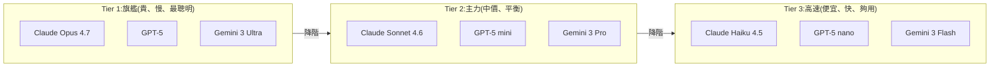

**價格差距很真實**:旗艦 vs 入門,每百萬 token 的價格可能差 20-50 倍。一個小 Side Project 用 Haiku/Flash 級別的模型,跟用 Opus 級別的模型,月費可能差 10 倍。

### 2.3 為什麼會有這麼多選擇?因為「沒有最強,只有最適合」

每個模型都有「個性」:
- **Claude**:偏向謹慎、會主動澄清、tool use 時敢說「我不確定,先查一下」
- **GPT**:偏向直接、自信、會把事情做完,但偶爾過度自信導致 hallucination
- **Gemini**:偏向結構化、條列式、結果整齊但有時過度格式化

這些差異不是 bug,是不同團隊的 RLHF 哲學造成的。實務上你會發現:寫 agent 用 Claude 順、做日常對話用 GPT 順、做超長文件用 Gemini 順。

### 2.4 Reasoning Model:會「先想再答」的新物種

第二堂課我們講過 Teacher Forcing、KV Cache、autoregressive 生成——所有 LLM 本質上都是「一個 token 一個 token 往下吐」。但 2024 年底開始,模型出現了一個重要的分化:**會不會在回答前先「想一下」**。

#### 普通 Model vs Reasoning Model

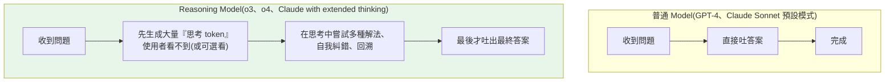

**關鍵差別**:reasoning model 會在「正式回答」前產生大量看不見的「內心獨白」,這些獨白就是它在思考、嘗試、糾錯的過程。

#### 用第二堂的知識理解:這些「思考」是什麼?

還記得第二堂的 KV Cache 嗎?reasoning model 的「思考」其實就是**多生成幾千個 token,但這些 token 不算進最終答案**。它們進入 KV Cache,影響後面的生成,但你看不到(或要付費才看得到)。

換句話說:reasoning model = 普通 LLM + 強化學習訓練它「先寫草稿再寫正式答案」。

#### 兩種模型實測對比

題目:「一個房間有 4 個角,每個角有一隻貓,每隻貓面前有 3 隻貓。房間裡總共有幾隻貓?」

**普通 Model 的回答**(直覺式):
> 4 個角 × 3 隻貓 = 12 隻,加上原本 4 隻,總共 16 隻。

**Reasoning Model 的內心獨白**(思考過程):
> 等等,讓我重新讀題目...「每隻貓面前有 3 隻貓」——這 3 隻可能就是另外 3 個角的貓本身。4 隻貓彼此都看得到對方,所以每隻貓「面前」確實是另外 3 隻。我先假設是 4 隻試試...4 隻貓,每隻看到另外 3 隻 ✓。答案應該是 4 隻。

**最終答案**:4 隻。

#### 什麼時候用 Reasoning Model

| 場景 | 用 Reasoning? | 原因 |
|------|--------------|------|
| 數學推導、邏輯謎題 | 強烈建議用 | 需要多步驗證 |
| 架構設計、技術選型 | 建議用 | 需要權衡多個因素 |
| Debug 複雜問題 | 建議用 | 需要排除多種可能 |
| 一般對話、寒暄 | **不要用** | 慢、貴、沒必要 |
| Autocomplete、IDE 補全 | **絕對不要** | 你打字 0.5 秒,它思考 30 秒 |
| 客服、FAQ | **不要用** | 簡單問題不需要思考 |

#### 成本與時間的代價

Reasoning model 的思考 token 也要算錢,而且通常**比普通 output token 還貴**。一次 reasoning 呼叫可能:
- 普通 model:500 output tokens,2 秒回應,成本 $0.01
- Reasoning model:500 output + 5000 thinking tokens,30 秒回應,成本 $0.15

15 倍價格、15 倍時間,換來在困難問題上 30-50% 的準確率提升。值不值得,看任務。

#### 給 Side Project 的實用建議

**不要把整個 App 都用 reasoning model**。常見的混合策略:
- 主要對話流:普通 model(Sonnet 4.6 / GPT-5 mini)
- 遇到困難子任務時:呼叫一次 reasoning model(Opus 4.7 / o3)
- 結果回到主流程繼續

這就像你不會請一個諾貝爾獎得主來幫你回 email——只在真正困難時才動用他。

### 2.5 模型成本結構:你的 Side Project 帳單怎麼來的

第二堂課講過 token 是什麼、為什麼中文 token 比英文多。這邊要把它跟「錢」連起來。

#### Input vs Output Token 價格不同

幾乎所有 LLM API 都有這個差別:**Output 比 Input 貴 3-5 倍**。

| 模型 | Input ($/1M tokens) | Output ($/1M tokens) | 比例 |
|------|---------------------|----------------------|------|
| Claude Opus 4.7 | $15 | $75 | 5x |
| Claude Sonnet 4.6 | $3 | $15 | 5x |
| Claude Haiku 4.5 | $0.80 | $4 | 5x |
| GPT-5 | $10 | $30 | 3x |
| Gemini 3 Pro | $2.50 | $10 | 4x |

(價格會變,但比例結構是穩定的)

**為什麼?** 還記得第二堂講的 LLM 推論是 memory-bound 嗎?Output 是一個一個 token 生成的,每個 token 都要重新走一次完整的 forward pass + 讀 KV cache。Input 是一次性 prefill,平行化效率高很多。所以 output 算力成本更高。

#### Prompt Caching:省 90% 成本的關鍵

如果你的 system prompt 很長(例如塞了 5000 字的文件作為 context)、而且會被重複呼叫,**Prompt Caching** 可以讓重複的部分只算 10% 的價錢。

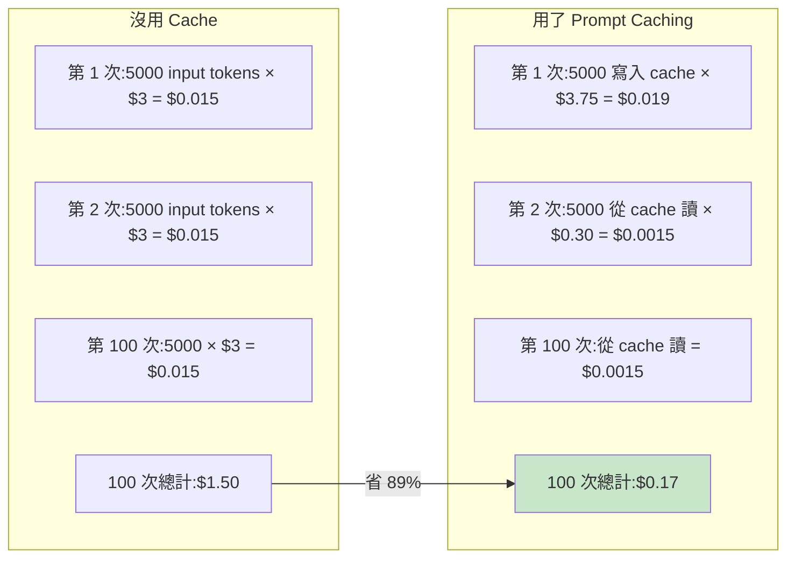

**用得到的場景**:
- 客服 bot(system prompt 固定)
- 對單一文件反覆問問題(文件當 cache)
- Agent 的工具列表(tools 定義固定)

#### Batch API:非即時任務打 5 折

如果你的任務不用即時結果(例如每晚整理當天 logs、生成週報),用 Batch API 可以打 5 折,代價是要等最多 24 小時。

#### 自架 vs API 的成本臨界點

很多學弟妹會問:「我自架開源模型會不會比較便宜?」答案:**通常不會,除非你量超大**。

| 場景 | 月費(API) | 月費(自架 Llama 4 + GPU) | 結論 |
|------|----------|--------------------------|------|
| 個人 Side Project,每月 100 萬 token | ~$10 | $200+(GPU 租用) | API 便宜 20 倍 |
| 小公司,每月 1 億 token | ~$1000 | $500-800 | 自架略便宜 |
| 大量隱私敏感資料 | 不能用 | 必須自架 | 自架是唯一選擇 |

**結論**:Side Project 階段不要想自架,直接用 API。等你的 App 真的有用戶量再考慮。

---

## 3. AI 工具大地圖

把 2026 年最值得認識的 AI 工具分成四大象限。記住這個地圖,之後遇到任何新工具都能歸類。

### 象限一:AI 編程工具(寫程式)

這類工具的目標是「讓寫程式變快」。

- **Claude Code**:Anthropic 出的命令列(CLI)工具,住在 terminal 裡。最新版本基於 Claude Opus 4.7,支援 Remote Control、Cloud Agents、Computer Use、Auto Mode 等功能。特色是擅長處理跨多個檔案的大型重構任務。
- **Cursor**:VS Code 的分支(fork),2026 年推出 Cursor 3 跟自己訓練的 Composer 2 模型。亮點是「Agents Window」可以同時跑多個 agent,還有 Design Mode 可以直接在瀏覽器點 UI 元素叫 AI 修改。
- **GitHub Copilot**:老牌選手,autocomplete 還是很強,是 JetBrains IDE 的主流選擇之一。
- **Windsurf**:Codeium 的產品,Cascade 是它的招牌 agentic 系統。

### 象限二:AI 工作流自動化(串接服務)

這類工具的目標是「讓重複性的事情自動跑」。

- **n8n**:開源、可自架、節點式視覺化工作流。2026 年已經有 70+ 個專屬 AI 節點,深度整合 LangChain、原生支援 MCP。本堂課會深入介紹。
- **Zapier**:老大哥,整合多但對於複雜 AI workflow 跟成本控制都不如 n8n。
- **Make(原 Integromat)**:介於兩者之間的選擇。

### 象限三:AI 創意生成(圖片、影片、音樂)

這類工具的目標是「產生視覺/聲音內容」。

- **ComfyUI**:節點式 Stable Diffusion 介面,70K+ GitHub stars。2026 年已支援 Flux、SDXL、SD 1.5/2.x、HunyuanVideo、Mochi 等模型。
- **Midjourney / DALL-E / Stable Diffusion WebUI(A1111)**:較不需要技術背景的選擇。
- **Runway / Sora**:影片生成主流。

### 象限四:AI 對話 & Agent 平台

這類工具的目標是「當你的個人助理」。

- **Claude Desktop**:Anthropic 的桌面 App,整合 MCP,可連 Google Drive、Gmail、Calendar 等。
- **ChatGPT Desktop**:OpenAI 的對應產品,2025 年也宣布支援 MCP。
- **Hermes Agent**:Nous Research 出的開源自主 agent,2026 年 2 月發布。重點是「持久記憶」跟「自動產生 skill」,可連接 Telegram、Discord、Slack、WhatsApp。

### 象限怎麼選

**選工具的核心問題不是「哪個最強」,而是「哪個最適合你現在的任務」。**

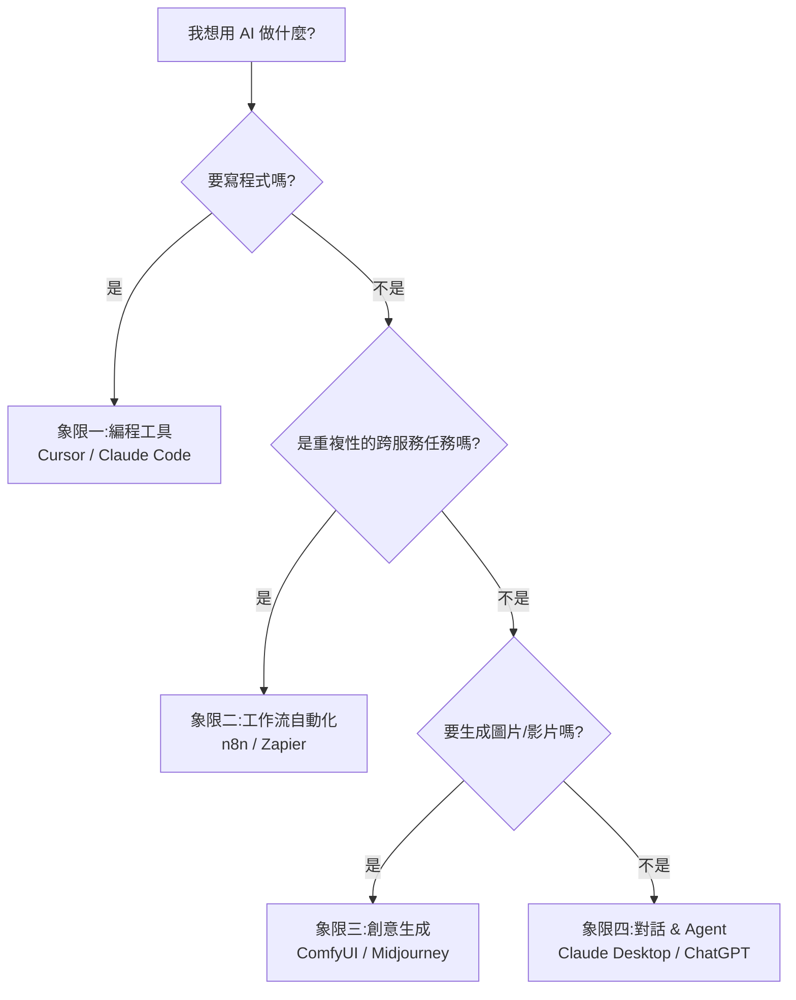

- 想寫一個 App → 象限一(編程)
- 想自動化重複任務 → 象限二(工作流)
- 想生成圖片素材 → 象限三(創意)
- 想要 AI 助理回答日常問題 → 象限四(對話)

很多人犯的錯是:用 ChatGPT 寫程式(不是不行,但 Cursor / Claude Code 強太多),或者用 Cursor 來自動化流程(殺雞用牛刀)。

---

## 4. 深度解剖:四大核心工具

接下來這四個工具會講得比較深,每個工具都會包含:**它是什麼、底層架構、核心概念、實戰範例、何時使用**。

---

### 4.1 Claude Code

#### 它是什麼

Claude Code 是一個住在 terminal 裡的 agentic coding tool。打開 terminal、輸入 `claude`,就進入一個對話框——但這個對話框可以讀取整個 codebase、執行 bash、編輯檔案、開 PR、部署。

它跟「在網頁上開 ChatGPT 然後複製貼上程式碼」最大的差別是:**它有手有腳**。它不只給你建議,它會直接動手做。

#### 底層架構

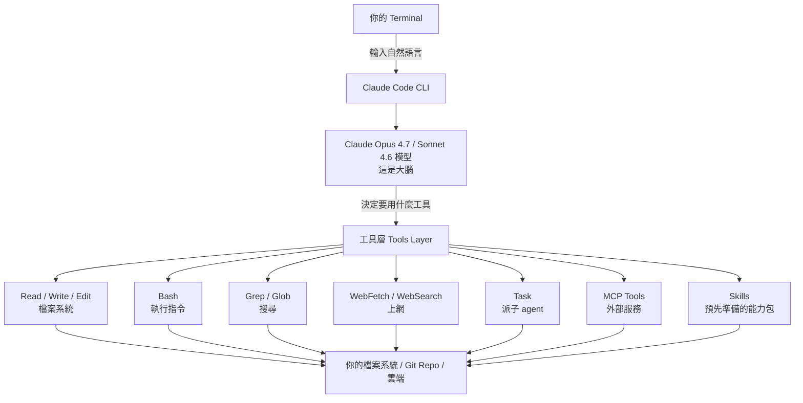

理解這個架構非常重要,因為它解釋了為什麼 Claude Code 比 ChatGPT 強:**ChatGPT 只有大腦,Claude Code 有大腦 + 工具 + 你的整個 codebase**。

#### 核心概念三件事

**第一件:Agentic Loop(代理迴圈)**

Claude Code 不是「你問一句它答一句」的對話模式。它會:
1. 收到你的指令
2. 自己拆解成子任務
3. 決定要呼叫哪些工具
4. 執行工具、看結果
5. 根據結果決定下一步
6. 一直跑到任務完成或它需要你確認

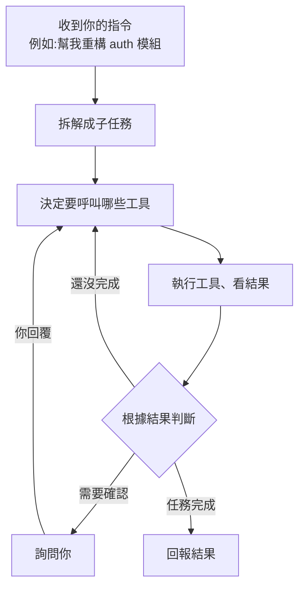

這個迴圈會自動跑下去。所以你下一個高層次指令(例如「幫我重構 auth 模組」),它會自己走完整個流程,不用你逐步指揮。

**實際案例**:你說「幫我把所有 API endpoint 加上 rate limiting」。Claude Code 的 Agentic Loop 可能會:
1. 先用 Grep 搜尋所有 route 定義(找到 15 個 endpoint)
2. 讀取現有的 middleware 結構
3. 建立一個 `rateLimiter.ts` middleware
4. 逐一在每個 route file 加上 middleware
5. 發現有 3 個 endpoint 已經有自己的 rate limit 邏輯,跳過
6. 跑測試確認沒壞東西
7. 回報:「已完成 12/15 個 endpoint 的 rate limiting,3 個已有自定義邏輯的跳過了」

**第二件:Context Engineering(情境工程)**

它會自動讀取:
- `CLAUDE.md`(你給它的專案說明文件)
- 相關檔案的內容
- git history
- 目前打開的檔案

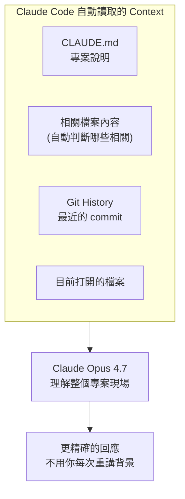

這代表你不用每次都重講背景,它會自己「讀懂」現場。但反過來說——**寫好 `CLAUDE.md` 是讓 Claude Code 變強的最重要動作**。

`CLAUDE.md` 應該寫什麼?
- 專案的目的(用一句話)
- 技術選型(語言、框架、版本)
- 程式碼風格規範(命名、檔案結構)
- 不能碰的部分(例如「不要動 `legacy/` 資料夾」)
- 常用指令(測試怎麼跑、build 怎麼跑、部署怎麼跑)

**一個好的 CLAUDE.md 範例:**

```markdown
# My E-commerce API

## 專案目的
後端 API,服務行動端 App 的商品瀏覽與購物車功能。

## 技術棧
- Python 3.12 + FastAPI
- PostgreSQL 16 + SQLAlchemy 2.0
- Redis 7(快取 + session)
- Docker Compose 開發環境

## 規範
- 所有 API response 用 Pydantic model
- 資料庫操作全部在 `app/repositories/` 裡
- Business logic 在 `app/services/`
- 不要動 `app/legacy/` — 那是舊版等著被淘汰的

## 常用指令
- 跑測試:`make test`
- 跑 linter:`make fix`
- 啟動開發環境:`docker-compose up -d`
- DB migration:`alembic upgrade head`
```

**Context Window 的實務管理:為什麼 Context 不是越大越好**

第二堂課我們算過:序列長度從 4K 變 32K,attention 的記憶體會爆 64 倍。雖然 FlashAttention、GQA、KV Cache 把這個問題緩解了不少,但**對使用者來說還是有實務上的痛點**——「大海撈針」(needle in a haystack)問題。

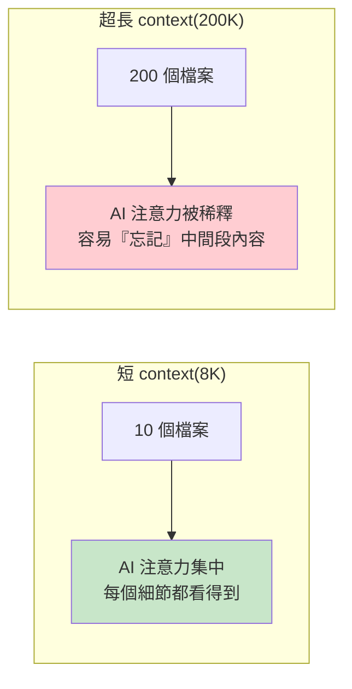

**實務影響**:當 Claude Code 的 context 塞太多東西,你會發現:
- 它開始「忘記」CLAUDE.md 裡的規範
- 對檔案內容的記憶變得不精確
- 偶爾會編造你給過的程式碼細節

**怎麼緩解?**
1. **不要把整個 codebase 塞進去**:讓 Claude Code 用 Grep / Glob 自己找需要的部分
2. **用 sub-agent 隔離 context**:Claude Code 的 `Task` 工具會派一個子 agent 處理子任務,主對話不會被汙染
3. **定期 `/clear`**:長對話到一定程度開新的,把重要結論寫進 CLAUDE.md

不同模型的 context 大小參考:
| 模型 | Context Window | 備註 |
|------|---------------|------|
| Claude Opus 4.7 | 200K-1M | 旗艦設定 |
| GPT-5 | ~400K | 中等 |
| Gemini 3 Pro | 1M-2M | 最大,但中段記憶仍會稀釋 |
| 開源模型(Llama 4) | 128K-256K | 跟商用接近了 |

**第三件:Permission System(權限系統)**

它每次要動檔案、執行命令前都會問你。可以設「Auto-approve」讓它自動跑,但要小心。2026 年新加的 `accept_edits` 模式可以讓它自動接受編輯但保留 bash 的人為審核——這是一個比較安全的折衷。

**為什麼權限系統重要?** 因為 AI 偶爾會做出不該做的事——例如 `rm -rf` 錯的目錄、push 到錯的 branch。權限系統是你的最後一道防線。

#### 2026 年值得記住的功能

- `/init`:在新專案上跑這個,它會自動分析專案結構、產生 `CLAUDE.md` 草稿
- `/review`:對整個 PR 做 code review
- `/security-review`:找安全漏洞
- `/ultrareview`:在雲端跑多個 agent 平行 review
- **Skills**:把 `.claude/skills/` 資料夾放在專案裡,定義你的自訂能力包
- **Sub-agents**:派子 agent 處理子任務,主對話的 context 不會被污染
- **Cloud Agents**:把任務丟到雲端跑,關掉筆電也繼續做
- **MCP integration**:連任何 MCP server,瞬間多出一堆工具

#### 什麼時候用 Claude Code

當任務具有以下特徵時,Claude Code 是首選:
- **複雜**:跨多個檔案、需要重構
- **需要長時間思考**:不是 30 秒能解決的小事
- **不需要視覺回饋**:跟 UI 沒關係,純後端 / 邏輯

具體例子:
- 「重構整個 auth 模組成 OAuth 2.1」
- 「分析這份 codebase 然後寫出架構文件」
- 「整個專案從 webpack 遷移到 vite」
- 「掃過所有 API endpoint,補上缺失的錯誤處理」

#### 安裝跟入門

```bash
# 安裝
npm install -g @anthropic-ai/claude-code

# 在任何專案資料夾
cd my-project
claude

# 第一次進去,先跑這個
> /init
```

之後就用自然語言對話。沒什麼花招。

---

### 4.2 Cursor

#### 它是什麼

Cursor 是一個 IDE。重點是:它是 VS Code 的 fork(分支),所以**你 VS Code 的所有 extension、theme、keybinding 都可以無痛遷移**。

換句話說,Cursor 不是要你「換一個編輯器」,而是「拿一個你已經熟的編輯器,加上 AI 超能力」。

#### Cursor 的三層互動模式

這個分層很重要——每一層代表「AI 自主程度不同」:

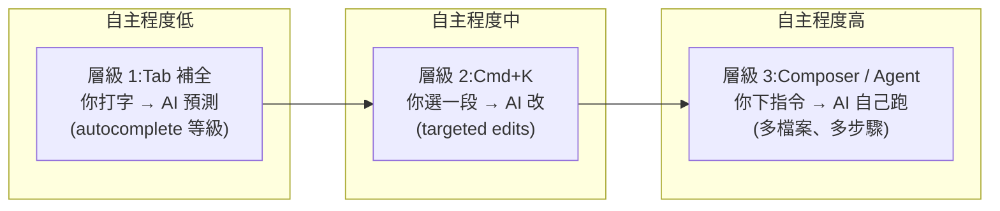

**真實情境對比:**

| 層級 | 你做的事 | AI 做的事 | 時間節省 |
|------|---------|----------|---------|
| Tab 補全 | 打 `const user = await db.` | AI 補完 `findUnique({ where: { id } })` | 5 秒 |
| Cmd+K | 選一段 fetch code,說「加上 retry 邏輯」 | 把 5 行變成 15 行含 exponential backoff | 3 分鐘 |
| Agent | 「新增 Google OAuth 登入功能」 | 建 3 個檔案、改 2 個現有檔案、裝套件 | 30 分鐘 |

**層級 1(Tab 補全)**:你寫一半,AI 預測你接下來要寫什麼,按 Tab 接受。最不費力、AI 自主性最低。
**層級 2(Cmd+K)**:選一段程式碼,按 Cmd+K,叫 AI「把這個改成 async」、「加上錯誤處理」。AI 動的範圍受限於你選的東西。
**層級 3(Composer / Agent)**:「幫我新增一個登入頁面,用 Tailwind」。AI 自己決定要新增哪些檔案、怎麼改現有檔案。自主性最高、也最容易出錯。

**新手建議**:從層級 1、2 開始用,等熟了再用層級 3。直接跳到 Agent 模式很容易產生你看不懂的程式碼。

#### Cursor 3 的架構

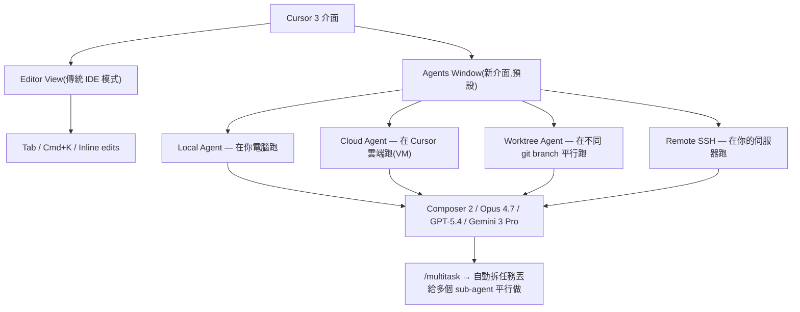

這代表你可以同時開好幾個 agent 各做各的——一個改前端、一個寫測試、一個生 API 文件——彼此不互相干擾。

**真實使用情境**:假設你在做一個 e-commerce 專案,有個新需求要加「商品搜尋功能」。你可以:
- Agent 1(Local):改前端搜尋 UI
- Agent 2(Worktree):在另一個 branch 寫搜尋 API 的單元測試
- Agent 3(Cloud):生成 Elasticsearch index mapping 文件

三個同時跑,你只管 review 結果。這就是 2026 年「一個人做三人份的工作」的具體方式。

#### Composer 2(Cursor 自己訓練的模型)

值得知道的是 Cursor 沒有只用別人的模型,他們自己訓了一個:
- 比同等智能的模型快 4 倍
- 大多數任務 30 秒內完成
- 內建 codebase-wide semantic search 工具
- 專門為「低延遲 agentic coding」優化

「快 4 倍」這件事比聽起來重要——當你在 IDE 裡寫 code,等待時間從 10 秒變 2.5 秒,整個工作流的順暢度會完全不同。

#### 每天會用的核心功能

**`.cursorrules`**:在專案根目錄放這個檔案,告訴 Cursor 這個專案的規範。例如:
```
- 使用 TypeScript,不要寫 plain JS
- 用 Tailwind,不要用 CSS-in-JS
- React component 一律用 function component + hooks
- 所有 API call 用 fetch,不要用 axios
```

**`@codebase` / `@docs` / `@web`**:在 prompt 裡用 `@` 指定上下文。
- `@codebase` → 讓 AI 搜你整個專案
- `@docs` → 讓 AI 讀你指定的官方文件
- `@web` → 讓 AI 上網查
- `@file` → 指定某個檔案

**Design Mode(2026 新功能)**:開瀏覽器,點 UI 上任何元素,叫 AI「把這個按鈕改紅色」、「這個 card 的圓角加大」。完全跳過「找 component → 找 className → 改 CSS」的流程。

**Multi-root workspace**:同時開多個 repo,叫 AI 跨 repo 改前後端。

**Bugbot**:自動審 PR、找 bug、修 bug。對於團隊開發特別有用。

#### Claude Code vs Cursor:什麼時候用哪個

| 情境 | 建議工具 |
|------|---------|
| 看整個 codebase 做大型重構 | Claude Code |
| 寫 UI、調整視覺、需要看瀏覽器即時效果 | Cursor |
| 跨專案、多 repo 操作 | Cursor 3 (multi-root) |
| CI/CD 整合、自動化任務 | Claude Code (CLI 友善) |
| 想看 AI 改了什麼、視覺化 diff | Cursor |
| Vim / Tmux 重度使用者 | Claude Code |
| 想要 IDE 完整體驗 | Cursor |

**實務上的真實工作流**:很多人兩個都用。Cursor 寫前端跟 UI、Claude Code 處理後端架構與 codebase 級別的任務。它們不是互相取代的關係。

---

### 4.3 n8n

#### 它是什麼

n8n 是一個**節點式工作流自動化平台**。把它想像成 Zapier 的開源加強版,但加上了 AI agent 的能力。

它存在的意義:把很多重複性、跨服務的工作自動化。例如「每天早上把昨天的 GitHub commits、Notion 任務、Calendar 會議整理成週報寄出去」——這種事情手動做要 30 分鐘,用 n8n 設定一次後就永遠自動跑。

#### 為什麼 2026 年值得學

- **75%** 的 n8n 用戶已經在用 AI 節點
- **70+** 個 AI 專屬節點,深度整合 LangChain
- 原生支援 **MCP**——你可以把 n8n workflow 變成 MCP server 讓 Claude 呼叫
- 自架 n8n 比 Zapier 便宜 10–50 倍(複雜 workflow 來說)
- 一個 VPS($15–25/月)可以取代 $500/月 的 Zapier

**成本比較實例:**

| 場景 | Zapier 月費 | n8n 自架月費 | 節省 |
|------|-----------|------------|------|
| 5 個簡單 workflow、每天各跑 1 次 | $29(Starter) | $5(最便宜 VPS) | 83% |
| 20 個 workflow、含 AI 節點、每天 100+ 次執行 | $199–$599 | $15–25(中等 VPS) | 90%+ |
| 企業級、50+ workflow、高頻觸發 | $1,200+(Team) | $25–50(高效能 VPS) | 96% |

但更重要的理由是:**它讓你練習「組合式思考」**。一個 workflow 就是一張流程圖,每個節點做一件小事,連起來解決一個大問題。這個思維方式對於後面的 Agent、MCP 都通用。

#### 核心概念:節點(Node)

n8n 的工作流由節點組成,每個節點是一個動作或資料轉換。

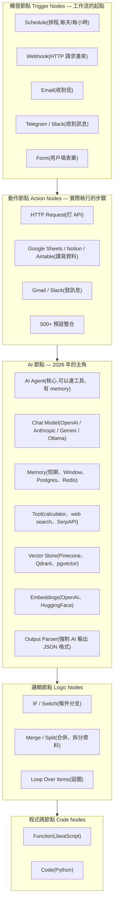

#### Embedding Model:不是 Chat Model 的另一種模型

在進到 AI Agent 節點之前,先講清楚一個常被搞混的概念:**Embedding model 跟 Chat model 是完全不同的東西**。

第二堂課我們講過 Embedding Layer——把 token ID 變成向量。但那是模型「內部」的 embedding。這裡講的 **Embedding Model** 是一個獨立的小模型,專門做一件事:**把整段文字變成一個固定維度的向量**。

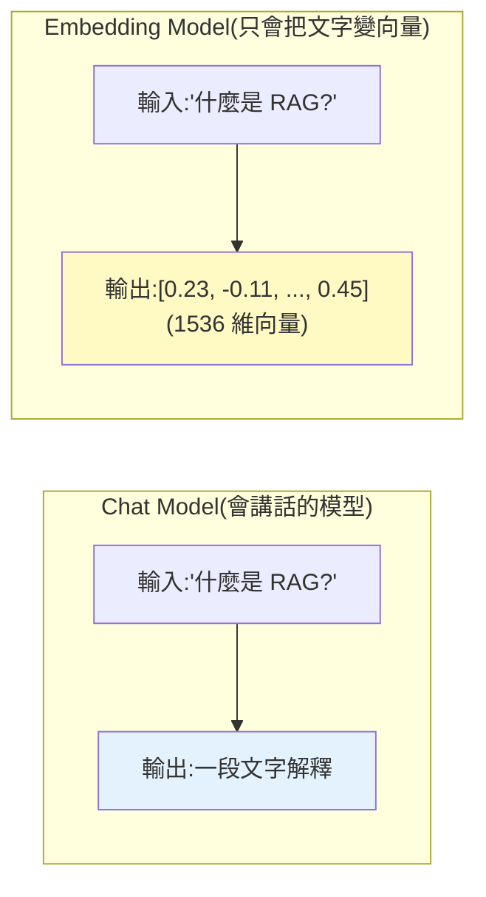

**為什麼要這個東西?** 因為要做 **RAG(Retrieval-Augmented Generation,檢索增強生成)**——讓 LLM 能查資料庫。

#### RAG 的完整流程

```mermaid
flowchart TD
    subgraph Index["階段 1:建索引(離線做一次)"]
        Doc["你的文件<br/>(PDF、Notion、網頁...)"] --> Chunk["切成小段(chunk)<br/>每段 200-500 字"]
        Chunk --> Emb1["每段送到 Embedding Model"]
        Emb1 --> Vec["變成向量"]
        Vec --> DB["存到 Vector Store<br/>(Pinecone / Qdrant / pgvector)"]
    end
    
    subgraph Query["階段 2:查詢(每次用戶問問題)"]
        Q["用戶問:『RAG 是什麼?』"] --> QEmb["送到 Embedding Model"]
        QEmb --> QVec["變成查詢向量"]
        QVec --> Search["在 Vector Store 找最相似的 5 段"]
        Search --> Context["把這 5 段塞進 prompt"]
        Context --> LLM["送給 Chat Model"]
        LLM --> Answer["生成答案<br/>(基於檢索到的內容)"]
    end
```

**主流 Embedding Model 選擇:**
| 模型 | 維度 | 特性 |
|------|------|------|
| OpenAI text-embedding-3-small | 1536 | 便宜、夠用 |
| OpenAI text-embedding-3-large | 3072 | 高品質、貴 |
| Cohere embed-v3 | 1024 | 多語言強 |
| Voyage AI voyage-3 | 1024 | 高品質開源替代 |
| BGE-large(開源) | 1024 | 可自架,免費 |

**維度的取捨**:維度越大、表達能力越強、但儲存跟搜尋越貴。768 維存 100 萬個 chunk 約 3GB,3072 維就要 12GB。

#### AI Agent 節點的內部結構

這是 n8n 在 2026 年最重要的進化。AI Agent 節點本身是一個複合節點,內部有四個子組件:

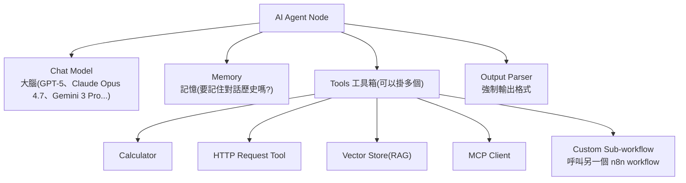

這個架構就是經典的 **ReAct(Reasoning + Acting)loop**:模型想 → 決定要不要用工具 → 用工具 → 看結果 → 再想 → ...

理解這個架構之後,你會發現「Agent」其實沒那麼神祕——它就是「LLM + 工具 + 記憶 + 一個迴圈」。

**ReAct Loop 在 n8n AI Agent 節點裡的實際運作:**

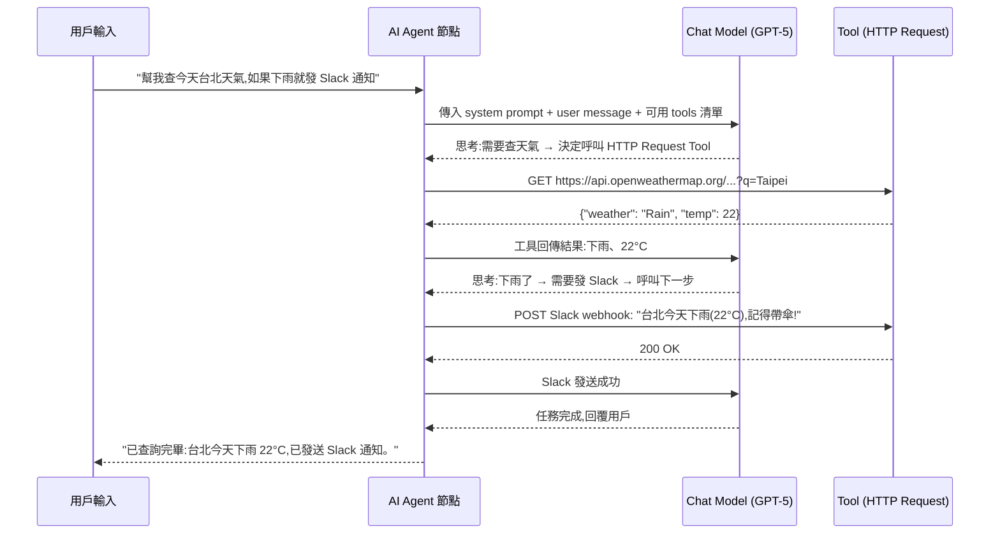

#### Function Calling / Tool Use 的可靠度差異

這個 ReAct Loop 有一個前提:**LLM 必須能正確產生「結構化的工具呼叫指令」**。這個能力叫做 **Function Calling**(或 Tool Use)。

不是所有模型都做得一樣好。第二堂課我們講過,LLM 本質上是 token 預測器,它「呼叫工具」其實是吐出一段格式化的文字(通常是 JSON),然後外部系統解析這段 JSON 去執行。所以可靠度取決於:**模型多守規矩、肯不肯亂發明參數**。

**主流模型的 Tool Use 可靠度比較:**

| 模型 | Tool Use 可靠度 | 並行呼叫 | 結構化輸出 | 備註 |
|------|----------------|---------|-----------|------|
| Claude Opus 4.7 | 極高 | 強 | 完美 | Agent 場景首選 |
| Claude Sonnet 4.6 | 高 | 強 | 完美 | CP 值之王 |
| GPT-5 | 高 | 中 | 強 | 偶爾「過度使用」工具 |
| Gemini 3 Pro | 中高 | 中 | 強 | 進步很多 |
| 開源 Llama 4 | 中 | 弱 | 中 | 需要更多 prompt 引導 |
| 早期開源模型 | 低 | 不支援 | 弱 | 不適合做 agent |

**「過度使用工具」是什麼意思?** 你問 GPT-5「2+2 等於幾」,它有時會去呼叫 calculator tool。雖然答案對,但浪費時間跟錢。Claude 比較會自己判斷「這簡單到不需要工具」。

**Parallel Tool Calling(並行工具呼叫)**:現代旗艦模型可以在一次回應裡同時呼叫多個工具。例如「幫我同時查台北、東京、紐約的天氣」,Claude 可以一次發出 3 個 API 呼叫並等所有結果回來,而不是一個一個串行。這對 Agent 速度影響巨大。

**Structured Output / JSON Mode**:強制模型輸出嚴格的 JSON 格式,不會夾雜「好的,以下是你要的 JSON:」這種廢話。n8n 的 Output Parser 就是用這個。

#### 實戰範例:自動週報機器人

這是一個真的能用的 workflow,學完之後可以自己組:

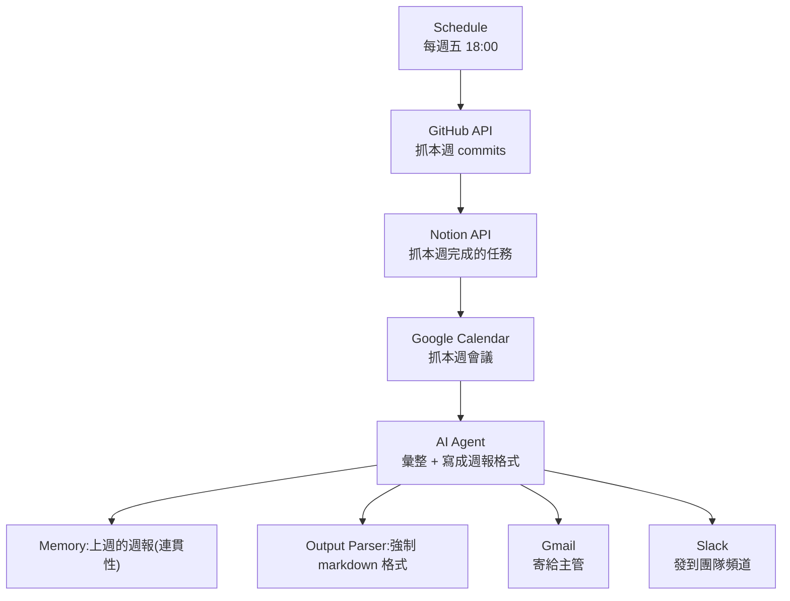

整個 workflow 大約 15–20 個節點,**完全不用寫程式**。少數需要客製邏輯的地方,可以塞 JavaScript 節點處理。

**具體的節點設定範例(GitHub API 節點):**

```json
{
  "node": "HTTP Request",
  "method": "GET",
  "url": "https://api.github.com/repos/{{$json.org}}/{{$json.repo}}/commits",
  "queryParameters": {
    "since": "{{ $now.minus(7, 'days').toISO() }}",
    "author": "your-github-username"
  },
  "headers": {
    "Authorization": "Bearer {{ $credentials.githubToken }}"
  }
}
```

**AI Agent 節點的 System Prompt 範例:**

```
你是一個週報撰寫助手。你會收到以下資料:
1. 本週的 GitHub commits 列表
2. Notion 完成的任務
3. 本週的會議列表

請用以下格式產出週報:
## 本週完成
- [項目1]:簡要描述
## 進行中
- ...
## 下週計畫
- 根據本週進度推測

風格:簡潔、專業、不超過 300 字。
```

這個範例的價值不只是「自動寫週報」,而是它示範了一個通用的模式:
1. **觸發**(什麼時候跑)
2. **取資料**(從哪些來源)
3. **加工**(用 AI 整理)
4. **輸出**(送到哪裡)

幾乎所有的 AI 自動化都是這四步驟的變化。

**另一個常見的 workflow 範例:客服自動分類回覆**

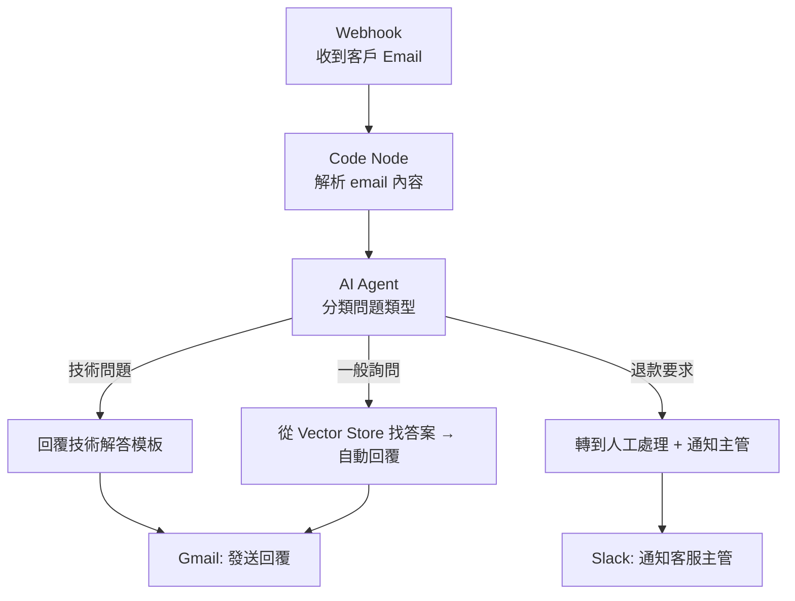

#### 什麼時候用 n8n

- 要把多個服務串起來(Notion + Gmail + GitHub + Slack...)
- 重複性的任務,每天/每週要做
- 需要 AI 處理結構化資料(分類、彙整、生成)
- 想做一個有 webhook 的小服務但懶得寫後端
- 想做一個 Telegram / Discord bot 但不想寫整個後端

#### 自架 vs 雲端

n8n 有兩種使用方式:

**雲端版(n8n Cloud)**:直接註冊、立刻用、不用管伺服器。月費 $20 起。
**自架(Self-hosted)**:跑在你自己的 VPS / Docker / Kubernetes 上。免費,但要會基本運維。

學弟剛入門建議用雲端版玩熟,等做出價值(例如取代了一些手動工作)再考慮自架。

---

### 4.4 ComfyUI

#### 它是什麼

ComfyUI 是一個**節點式的 Stable Diffusion 介面**,70K+ GitHub stars,AI 生圖領域的「進階使用者」標準工具。

跟 Midjourney 那種「打 prompt → 出圖」的黑盒子不一樣,ComfyUI 是把整個生圖流程「拆開」給你看。每一步——載入模型、編碼文字、加噪、去噪、解碼——都是一個獨立節點,你可以拆開、組裝、客製。

#### 為什麼用 ComfyUI 不用 Midjourney

- 完全免費、跑在自己的 GPU
- 可以用任何開源模型(Flux、SDXL、SD 1.5/2.x、HunyuanVideo、Mochi)
- 可重現性 100%(同樣的 workflow JSON + 同樣的 seed = 同樣的圖)
- 對 pipeline 每一步都有完全控制
- 可以做 Midjourney 做不到的事(精確 inpainting、ControlNet、character consistency)

但代價是:**陡峭的學習曲線**。第一次打開 ComfyUI 你會看到一堆節點然後完全不知道在幹嘛。這份教材的目標就是讓你看到節點圖時不會慌。

#### Multimodal Model:從文字到圖片的橋樑

第二堂課我們講過 CLIP、BLIP、LLaVA——三個不同的 multimodal 模型。ComfyUI 用到的就是 CLIP 的延伸:**Text Encoder 把你的 prompt 變成模型懂的「條件向量」**。

而現在還有一個新的應用方向:**Vision Model 的「圖像理解」能力**。

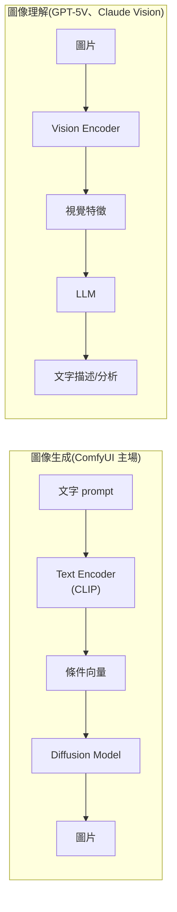

**為什麼這個區分對 Side Project 有用?**
- 想做「自動寫部落格 + 配圖」→ 用 LLM(GPT/Claude)寫文,用 ComfyUI/Midjourney 生圖,兩個分開
- 想做「上傳食物照片 → 計算熱量」→ 用 Vision Model(Claude Vision、GPT-5V),不需要生成圖
- 想做「設計稿轉 React 程式碼」→ 用 Vision Model 讀截圖 + Coding LLM 寫程式

**Cursor 的 Design Mode 就是 Vision Model 的應用**:你截一張設計稿給它,它能「看懂」並生成對應的 HTML/CSS。背後是 Claude / GPT 的視覺能力。

#### 核心概念:DAG(Directed Acyclic Graph 有向無環圖)

ComfyUI 用節點圖描述整個生成流程。每個節點有 input 跟 output,邊(edge)連接資料流。系統用 lazy evaluation——只有當輸出被需要時才執行。

「DAG」這個詞聽起來很學術,但它的概念很簡單:**資料從左流到右,不能繞回來**。每個節點等它需要的資料都到齊了才執行。

**用日常生活類比 DAG:**

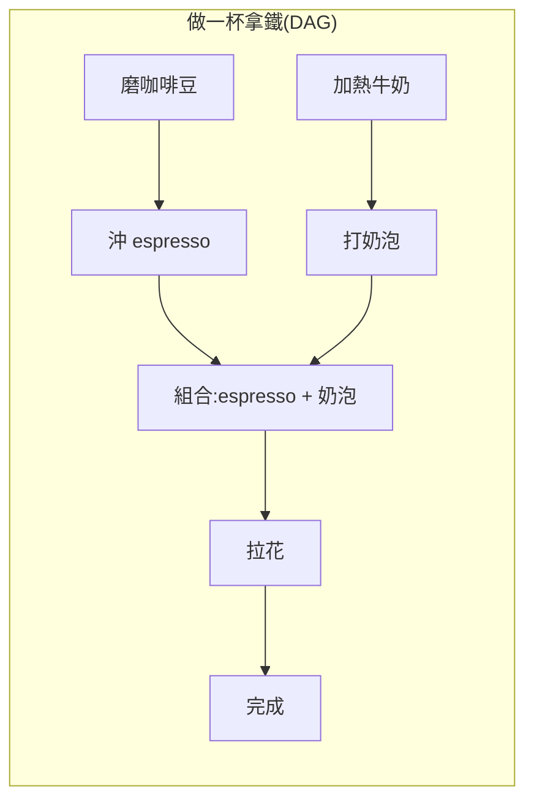

注意:「磨咖啡豆」跟「加熱牛奶」可以**平行**做(它們互不依賴),但「組合」必須等兩邊都完成。ComfyUI 的節點圖也是這個邏輯——互不依賴的節點可以平行計算,有依賴關係的必須等前面完成。

**為什麼「無環」很重要?** 如果資料可以「繞回來」(A → B → C → A),系統會陷入無限迴圈。DAG 保證每個節點最多執行一次,流程一定會結束。

#### 最基本的 Stable Diffusion workflow(解剖)

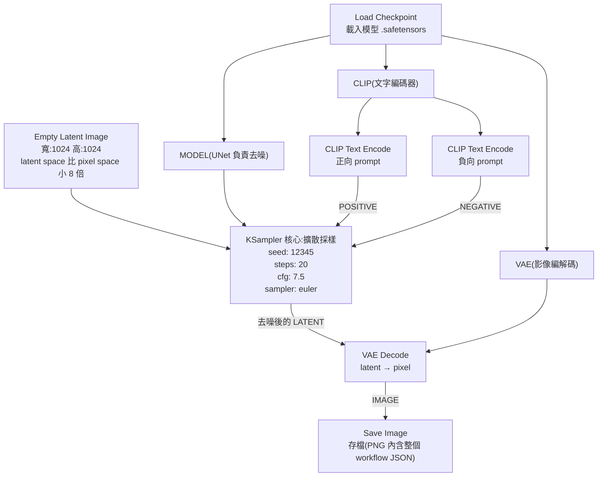

#### 重點觀念解析

**Checkpoint 是什麼?**
Stable Diffusion 模型本體,內含三個東西打包在一起:
- **UNet**:負責去噪的神經網路
- **CLIP**:文字編碼器,把你的 prompt 變成模型懂的數字
- **VAE**:負責 latent space 跟 pixel space 之間的轉換

換 checkpoint 就是換整個畫風(寫實、動漫、油畫)。

**常見 Checkpoint 舉例:**
| Checkpoint 名稱 | 風格 | 適合場景 |
|----------------|------|---------|
| Realistic Vision | 寫實人像 | 產品模特、人物攝影 |
| DreamShaper | 半寫實/奇幻 | 概念藝術、遊戲美術 |
| Anything V5 | 動漫風格 | 動漫角色、插畫 |
| Flux.1 dev | 通用高品質 | 2024-2026 年新一代架構,文字理解力最強 |

**Latent Space 是什麼?**
不是直接在 1024x1024 像素上做 diffusion(那樣計算成本太高),而是壓縮成 128x128x4 的 latent representation,做完所有去噪後再用 VAE 解回像素。這就是為什麼 Stable Diffusion 可以在消費級 GPU 上跑。

```mermaid
flowchart LR
    A["原始圖像<br/>1024×1024×3<br/>= 3,145,728 個數值"] -->|VAE Encode<br/>壓縮 48 倍| B["Latent Space<br/>128×128×4<br/>= 65,536 個數值"]
    B -->|在這裡做 diffusion<br/>計算量小很多| C["去噪後的 Latent"]
    C -->|VAE Decode<br/>還原| D["最終圖像<br/>1024×1024×3"]
```

**類比**:就像你壓縮一個 100MB 的影片成 2MB 的預覽縮圖來做標記,標記完再根據標記重建完整影片。在小的表示上做運算,速度快非常多。

**CFG(Classifier-Free Guidance)是什麼?**
控制 AI 多「聽話」的旋鈕。
- 低 CFG(例如 4)→ AI 比較有創意、可能偏離 prompt
- 高 CFG(例如 12)→ AI 嚴格照 prompt 走,但畫面可能僵硬
- 一般用 7–8 是甜蜜點

**CFG 的技術原理**:模型會同時產生「有引導」和「無引導」兩個預測,CFG 值就是把兩者的差異放大多少倍。公式是:`output = unconditioned + CFG × (conditioned - unconditioned)`。CFG=1 就是純粹按照模型自己的想法走,CFG=7 就是把「prompt 帶來的方向」放大 7 倍。

**Seed 是什麼?**
決定起始 noise 的隨機種子。同一個 seed + 同一個 prompt + 同一個 workflow = 同一張圖。這就是 ComfyUI「可重現性」的來源。

**實際應用場景**:你生了一張很滿意的圖(seed: 42),想微調 prompt 讓角色衣服從藍色變紅色。保持 seed=42,只改 prompt 中的顏色描述,構圖幾乎不變,只有顏色改了。這在 Midjourney 幾乎不可能做到。

**Steps 是什麼?**
去噪步數。20 步是常見起點。步數越多、品質可能越好但時間越久;超過某個點(通常 30–50)邊際效益就遞減。

**Steps 對生成品質的影響:**
| Steps | 效果 | 生成時間(RTX 4090) | 適合場景 |
|-------|------|---------------------|---------|
| 5-10 | 粗糙草稿 | ~1 秒 | 快速預覽構圖 |
| 15-20 | 品質良好 | ~3 秒 | 日常使用 |
| 30-40 | 精細 | ~6 秒 | 最終成品 |
| 50+ | 邊際效益極低 | ~10 秒 | 通常沒必要 |

#### 進階節點與技術

當你熟基本流程後,會用到這些:

- **LoRA**:小型微調模型,加進 model 流可以注入特定風格 / 角色(檔案小、訓練快)
- **ControlNet**:用一張參考圖(pose、edge、depth)控制構圖
- **IP-Adapter**:用一張參考圖控制風格 / 人臉
- **InstantID**:人臉一致性
- **Upscaler nodes**:放大(ESRGAN、4x-UltraSharp...)
- **Face Restoration**(CodeFormer、GFPGAN):修人臉
- **Inpainting / Outpainting nodes**:局部重繪、外擴

#### 進階 workflow 範例:人物一致性出多角度圖

當你做專案需要「同一個角色多張不同姿勢的圖」時:

```mermaid
flowchart LR
    CK["Load Checkpoint<br/>Flux.1 dev"] --> LoRA["Load LoRA<br/>Anime style"]
    LoRA --> IPA["IP-Adapter<br/>上傳一張角色臉"]
    IPA --> CN["ControlNet<br/>OpenPose 控制姿勢"]
    CN --> KS["KSampler"]
    KS --> VD["VAE Decode"]
    VD --> UP["Upscale"]
    UP --> FR["Face Restore"]
    FR --> Save["Save Image"]
```

整個 workflow 可能 30–50 個節點。Pro 用戶會把這個存成 JSON 範本,反覆使用。

**各個進階節點的白話解釋:**

| 節點 | 類比 | 作用 |
|------|------|------|
| LoRA | 給畫家一本「風格參考書」 | 小型微調模型(通常 10-200MB),注入特定風格或角色特徵 |
| ControlNet | 給畫家一個「構圖草稿」 | 用姿勢骨架圖/邊緣線稿/深度圖來控制最終構圖 |
| IP-Adapter | 給畫家看一張「參考圖」 | 用一張圖的風格或人臉特徵來影響生成結果 |
| Upscaler | 拿放大鏡看並補細節 | 把 1024px 放大到 4096px 同時補充細節 |

#### 什麼時候用 ComfyUI

- 要做專案需要的素材圖(遊戲美術、產品圖、概念圖)
- 要 character consistency(同一個角色多張圖)
- 要可控性高的構圖(指定 pose、depth)
- 想學 diffusion model 怎麼運作

#### 工具選擇對比

- 想 5 分鐘出圖 → Midjourney
- 想要產業級、可控、可重現 → ComfyUI
- 完全不懂技術 → DALL-E 3(ChatGPT 內建)

---

## 5. 新名詞完整解剖

這一段把學弟們最容易搞混的 4 個名詞講清楚。理解這些之後,看到任何 AI 工具都不會被新詞唬住。

---

### 5.1 MCP(Model Context Protocol)

#### 一句話定義

**AI 界的 USB-C,讓 LLM 連接外部工具的標準協定。**

#### 身世

- Anthropic 在 2024 年 11 月發布
- 2025 年 3 月 OpenAI 也採用
- 2025 年 12 月 Anthropic 把 MCP 捐給 Linux Foundation 旗下的 Agentic AI Foundation
- 2026 年初已經有 500+ 個公開 MCP server

捐出去這件事很重要——它代表 MCP 不再是 Anthropic 的私人協定,而是業界共通標準。

#### 為什麼需要它?N×M 整合問題

沒有 MCP 之前的世界:

```mermaid
flowchart TD
    subgraph LLMs
        Claude
        GPT
        Gemini
    end
    subgraph Services["每個 LLM 各自寫整合 = N×M"]
        GitHub
        Slack
        Notion
    end
    Claude --> GitHub
    Claude --> Slack
    Claude --> Notion
    GPT --> GitHub
    GPT --> Slack
    GPT --> Notion
    Gemini --> GitHub
    Gemini --> Slack
    Gemini --> Notion
```

每個 LLM 廠商都要為每個服務寫一份整合。3 個 LLM × 100 個服務 = 300 份整合。

有 MCP 之後:

```mermaid
flowchart TD
    subgraph Clients["MCP Clients(都講同一個協定)"]
        Claude
        GPT
        Gemini
    end
    
    MCP["MCP 標準協定層"]
    
    subgraph Servers["MCP Servers(一個 server 寫一次,所有 LLM 都能用)"]
        GH["GitHub MCP Server"]
        SL["Slack MCP Server"]
        NT["Notion MCP Server"]
    end
    
    Claude --> MCP
    GPT --> MCP
    Gemini --> MCP
    MCP --> GH
    MCP --> SL
    MCP --> NT
```

3 個 LLM + 100 個服務 = 103 份整合。差距巨大。

**類比:USB-C 之前 vs 之後**

想像 MCP 之前就像 2015 年——每台手機充電線都不同(Lightning、Micro USB、Mini USB、各種私有規格),每個配件商要為每種接口都做一個版本。MCP 之後就像 USB-C 統一——廠商只要做一個 USB-C 版本,所有裝置都能用。

#### MCP 的三層架構

```mermaid
flowchart LR
    subgraph Host["Host(應用程式)"]
        direction TB
        H1["Claude Desktop / Cursor / VS Code / 自己寫的 Agent"]
        H2["管理 LLM context<br/>決定何時呼叫工具<br/>把結果餵回 LLM"]
    end
    
    subgraph Client["Client(協議翻譯員)"]
        direction TB
        C1["內嵌在 Host 裡"]
        C2["負責 LLM 跟 Server<br/>之間的訊息傳遞"]
    end
    
    subgraph Server["Server(工具提供方)"]
        direction TB
        S1["獨立程式或服務"]
        S2["提供工具給 LLM"]
    end
    
    Host <-->|"JSON-RPC 2.0<br/>透過 stdio 或 HTTP/SSE"| Client
    Client <-->|"JSON-RPC 2.0<br/>透過 stdio 或 HTTP/SSE"| Server
```

簡單記法:**Host 是用 AI 的 App、Client 是 App 內的協議模組、Server 是提供能力的外部程式**。

**具體例子讓你理解三層各自的角色:**

假設你在 Cursor 裡說「幫我在 GitHub 上開一個 issue」:

```mermaid
sequenceDiagram
    participant You as 你
    participant Host as Cursor(Host)
    participant LLM as Claude Opus 4.7
    participant Client as MCP Client(Cursor 內建)
    participant Server as GitHub MCP Server(本地程序)
    participant GH as GitHub API

    You->>Host: "幫我在 my-repo 開一個 issue,標題是 Fix login bug"
    Host->>LLM: 傳送 user message + 可用 MCP tools 列表
    LLM-->>Host: 決定呼叫 tool: create_github_issue
    Host->>Client: 請呼叫 create_github_issue(title, body)
    Client->>Server: JSON-RPC: {"method":"tools/call", "params":{...}}
    Server->>GH: POST /repos/you/my-repo/issues
    GH-->>Server: 201 Created, issue #42
    Server-->>Client: {"result": {"issue_url": "..."}}
    Client-->>Host: 工具回傳結果
    Host->>LLM: 告知工具結果
    LLM-->>Host: "已建立 Issue #42: Fix login bug"
    Host-->>You: 顯示回覆
```

#### MCP Server 提供的三種能力

**1. Tools(工具)**:可執行操作,會產生副作用。
- 例:`create_github_issue`、`send_email`、`run_sql_query`
- 類比:「手」——做事情、改變世界

**2. Resources(資源)**:唯讀資料。
- 例:`file://path/to/file`、`db://users/123`
- 類比:「眼睛」——只看不動

**3. Prompts(提示)**:預先準備的 prompt 模板,使用者可以選用。
- 例:「分析這份 log 找出錯誤」這種模板
- 類比:「食譜」——預先寫好的操作步驟

```mermaid
flowchart TD
    Server["MCP Server<br/>(例如 GitHub MCP Server)"]
    Server --> Tools["Tools(工具)"]
    Server --> Resources["Resources(資源)"]
    Server --> Prompts["Prompts(提示模板)"]
    
    Tools --> T1["create_issue — 建 issue"]
    Tools --> T2["create_pr — 建 PR"]
    Tools --> T3["merge_pr — 合併 PR"]
    
    Resources --> R1["repo://org/repo/README.md"]
    Resources --> R2["repo://org/repo/issues/42"]
    
    Prompts --> P1["code-review: 對這個 PR 做 review"]
    Prompts --> P2["security-scan: 掃描安全漏洞"]
```

#### 通訊協定底層:JSON-RPC 2.0

每個訊息長這樣:
```json
{
  "jsonrpc": "2.0",
  "id": 1,
  "method": "tools/call",
  "params": {
    "name": "create_github_issue",
    "arguments": {
      "title": "Fix login bug",
      "body": "Users can't login on Safari"
    }
  }
}
```

不需要記細節,只要知道**MCP 用的是標準的 JSON-RPC,不是什麼神祕協議**就好。

**JSON-RPC 2.0 是什麼?** 一個超簡單的遠端程序呼叫標準——你送一個 JSON 說「我要呼叫哪個 method、參數是什麼」,對方回一個 JSON 告訴你結果。它被廣泛用在很多地方(例如 Ethereum 的節點通訊也用 JSON-RPC)。MCP 選它的原因是:簡單、所有語言都有 library、容易 debug(因為是純文字 JSON)。

**完整的一來一回:**
```json
// → Client 發送請求
{"jsonrpc":"2.0", "id":1, "method":"tools/call", "params":{"name":"search_files","arguments":{"query":"Q3 report"}}}

// ← Server 回傳結果
{"jsonrpc":"2.0", "id":1, "result":{"content":[{"type":"text","text":"Found: Q3_Report_2026.docx in /Documents/"}]}}
```

#### 兩種傳輸方式

- **stdio**:本地子程序通訊。Claude Desktop 啟動一個本地的 MCP server 就用這個。
- **HTTP/SSE**:遠端 MCP server,可以雲端部署。2026 年正在朝 stateless HTTP 演進,方便水平擴展。

```mermaid
flowchart LR
    subgraph Local["本地模式(stdio)"]
        CD["Claude Desktop"] -->|"啟動子程序<br/>stdin/stdout 通訊"| LS["本地 MCP Server<br/>(例如 filesystem server)"]
        LS --> FS["你的電腦檔案系統"]
    end
    
    subgraph Remote["遠端模式(HTTP/SSE)"]
        Cursor["Cursor"] -->|"HTTPS 請求<br/>SSE 回傳串流"| RS["雲端 MCP Server<br/>(例如 Cloudflare Workers)"]
        RS --> API["第三方 API<br/>(GitHub、Slack 等)"]
    end
```

**什麼時候用哪種:**
| 傳輸方式 | 適合場景 | 設定方式 |
|---------|---------|---------|
| stdio | 本地工具(檔案操作、本地 DB) | 在 claude_desktop_config.json 裡指定 command |
| HTTP/SSE | 雲端服務、團隊共用的工具 | 在設定裡指定 URL endpoint |

**stdio 設定範例(claude_desktop_config.json):**
```json
{
  "mcpServers": {
    "filesystem": {
      "command": "npx",
      "args": ["-y", "@modelcontextprotocol/server-filesystem", "/Users/you/projects"]
    }
  }
}
```

#### MCP 的進階能力(2026 年加的)

- **Sampling**:MCP server 反過來請 LLM 幫它做事(例如 server 收到任務後,請 LLM 先生成計畫)
- **Elicitation**:server 在執行中可以問 user 問題(例如「要 commit 到哪個 branch?」)
- **Roots**:client 告訴 server「你只能存取這個目錄」
- **MCP Apps(SEP-1865)**:server 可以回傳 React UI 元件給 host 渲染

```mermaid
sequenceDiagram
    participant User as 用戶
    participant Host as Host (Claude Desktop)
    participant Server as MCP Server (Git)

    User->>Host: "幫我 commit 目前的改動"
    Host->>Server: tools/call: git_commit
    
    Note over Server: Elicitation: 需要更多資訊
    Server-->>Host: elicit: "commit message 要寫什麼?"
    Host-->>User: 顯示問題
    User->>Host: "Fix login timeout bug"
    Host->>Server: 回傳 user 回答
    
    Note over Server: Sampling: 請 LLM 幫忙
    Server-->>Host: sampling_request: "根據 diff 生成更詳細的 commit body"
    Host->>Host: LLM 生成 commit body
    Host-->>Server: "Fixed the session timeout issue..."
    
    Server->>Server: git commit -m "Fix login timeout bug\n\nFixed the session..."
    Server-->>Host: 成功 commit
    Host-->>User: "已 commit: Fix login timeout bug"
```

這些進階能力讓 MCP 不只是「單向呼叫工具」,而是「雙向協作」——server 可以反問、可以請 LLM 幫忙、可以渲染 UI。

#### 實戰:Claude Desktop 連 Google Drive

設定步驟(學弟可以實際做做看):
1. 打開 Claude Desktop 設定
2. 找到 MCP 設定區
3. 加入 Google Drive MCP server
4. 跟 Claude 說:「幫我找上週寫的 Q3 報告」
5. Claude 會呼叫 Google Drive MCP server 的 `search_files` 工具去找

這就是 MCP 的價值:**Claude 從「只能講話」變成「能動手」**。

---

### 5.2 Skills(Agent Skills)

#### 一句話定義

**程式裡的 `import`,AI 預先準備好的能力模組,AI 自己決定何時要用。**

#### 身世

- Anthropic 2025 年 10 月發布
- 2025 年 12 月成為 open standard(agentskills.io),跨平台支援
- 同一個 SKILL.md 可以在 Claude Code、Cursor、Gemini CLI、Codex CLI 通用

#### Skill 的本質:一個資料夾

```
my-skill/
├── SKILL.md          # 必要:metadata + 指令
├── scripts/          # 選用:可執行程式碼
│     ├── helper.py
│     └── parse.py
├── references/       # 選用:參考文件
│     └── api-spec.md
├── assets/           # 選用:模板、圖檔
│     └── template.docx
└── evals/            # 選用:測試
      └── evals.json
```

不需要任何特殊程式語言、不需要編譯。就是一個資料夾、一份 markdown 檔。簡單到不像話。

**跟程式設計的類比:**

| 程式概念 | Skill 對應 |
|---------|-----------|
| `import pandas as pd` | Agent 載入一個 Skill |
| library 的 README | `SKILL.md` |
| library 的 source code | `scripts/` 資料夾 |
| library 的 docs | `references/` 資料夾 |
| `pip install` | 把 skill 資料夾放到 `.claude/skills/` |

#### SKILL.md 長這樣

```markdown
---
name: pdf-form-filler
description: Fill PDF forms with data from a JSON file. 
             Use when user wants to populate a PDF form 
             template with structured data.
---

# PDF Form Filler

## Instructions
1. Read the JSON data file using the Read tool
2. Use scripts/fill_pdf.py to populate the form
3. ...

## Examples
...
```

最上面的 frontmatter 是 metadata,下面是 markdown 指令。

#### Progressive Disclosure(漸進揭露)— Skill 的核心設計

這是 Skills 最聰明的地方:

```mermaid
flowchart TD
    Start["Agent 啟動"] --> Load["系統 prompt 只載入<br/>所有 skills 的 name + description<br/>(第一層揭露,輕量)"]
    Load --> Receive["Agent 收到 user 訊息"]
    Receive --> Judge{"Agent 判斷:<br/>這個任務需要哪個 skill?"}
    Judge -->|不需要| Direct["直接回答"]
    Judge -->|需要| Trigger["觸發某個 skill<br/>載入完整的 SKILL.md 到 context<br/>(第二層揭露)"]
    Trigger --> Need{"SKILL.md 裡指向<br/>更詳細的 references/ 或 scripts/"}
    Need --> Deep["Agent 按需載入<br/>(第三層揭露)"]
    Deep --> Execute["執行任務"]
```

**為什麼這個設計很重要?**

第二堂課我們講過 LLM 的 context window 是有限的(也算過 attention 的 O(n²) 記憶體成本)。如果你把一千個工具的詳細說明全塞進去,要麼塞不下、要麼塞下了但 LLM 注意力被稀釋(這就是前面 Claude Code 講的 context 管理問題)。

Progressive disclosure 的解法是:**先給目錄、需要才翻內頁**。你可以塞無限多的 skill 到 agent 裡,但只有 metadata 進 context。一個 skill 內部可以有 100MB 的參考資料,只在需要時才讀進來,不會爆炸 context window。

**用實際的記憶體數字感受差異:**

假設你有 50 個 Skills,每個完整 SKILL.md 平均 2000 tokens:
- **不用 Progressive Disclosure**:50 × 2000 = 100,000 tokens 直接塞入 context → 佔掉大半的 context window,LLM 注意力被嚴重稀釋
- **用 Progressive Disclosure**:50 × 30(只有 name + description)= 1,500 tokens + 一次只載入需要的那 1-2 個 skill ≈ 5,500 tokens → 只佔 context 的 5%

這就是為什麼 Cursor 可以有上百個 Skill 卻不影響效能。

#### Skills vs Tools 的差別

|       | Tools | Skills |
|-------|-------|--------|
| 本質 | 一個函式 | 一包指令+資源 |
| 行為 | 執行 → 回傳結果 | 注入指令到 context,準備 Claude 解任務 |
| 載入 | 啟動就全載入 | 動態載入 |
| 可擴充性 | 受 context window 限制 | 幾乎無上限 |

簡單記法:**Tool 是「動詞」、Skill 是「教科書」**。Tool 是 AI 執行的動作,Skill 是教 AI 怎麼做某類任務的知識包。

#### Skills vs MCP 的關係

不衝突,是互補:
- **MCP server** 提供「工具」(會呼叫的東西)
- **Skill** 提供「知識 + 指令」(怎麼用工具的 know-how)

例如 Sentry 出了一個 `sentry-code-review` skill,內容是「怎麼用 Sentry 的 MCP server 自動分析跟修 bug 的最佳流程」。

#### Anthropic 官方公開的 Skills

可以直接用、也可以拿來當參考範例:
- `pptx`、`docx`、`xlsx`、`pdf`:文件處理
- `frontend-design`:避免 AI 生成的 UI 看起來像「AI slop」
- `skill-creator`:用 skill 來創 skill
- `mcp-builder`:教 Claude 怎麼寫 MCP server

#### 自己寫一個 Skill

當你發現「這件事我已經叫 AI 做過第三次了」,就該寫成 skill。流程:
1. 在專案 `.claude/skills/my-task/` 建立資料夾
2. 寫 `SKILL.md`,描述什麼時候該用、怎麼用
3. 把參考資料、輔助腳本放進去
4. 之後 AI 遇到符合 description 的任務,會自動觸發

寫得好的 skill description 是「**何時該用我**」+ 「**我能做什麼**」。AI 看 description 決定要不要載入完整內容。

---

### 5.3 Hermes Agent

#### 一句話定義

**開源、自架、會「越用越聰明」的個人 AI agent。**

#### 身世

- Nous Research 開發(就是出 Hermes、Nomos、Psyche 開源模型那家)
- 2026 年 2 月發布
- MIT License
- 截至 2026 年 4 月已 64,000+ GitHub stars
- 一行 curl 安裝

#### 核心架構

```mermaid
flowchart TD
    HA["Hermes Agent"]
    
    subgraph Memory["持久記憶 Persistent Memory"]
        M1["MEMORY.md — 環境資訊、過去學到的"]
        M2["USER.md — 使用者偏好、工作習慣"]
        M3["SQLite — 全文搜尋過去對話(FTS5)"]
    end
    
    subgraph Loop["自我學習迴圈 Self-Improving Loop"]
        SL["完成任務 → 評估 → 抽出模式 → 寫成 skill → 下次直接用<br/>(自動產生 SKILL.md,符合 agentskills.io 標準)"]
    end
    
    subgraph Gateway["多平台閘道 Gateway"]
        G1["Telegram"]
        G2["Discord"]
        G3["Slack"]
        G4["WhatsApp"]
        G5["Signal"]
        G6["Email"]
        G7["CLI"]
    end
    
    subgraph Schedule["排程系統"]
        SC["用自然語言設 cron<br/>「每天早上 8 點寄昨天的 GitHub commits 摘要」"]
    end
    
    subgraph SubAgent["Sub-agent 系統"]
        SA["每個子 agent 有自己的對話、terminal、Python RPC<br/>主 agent context 不會爆"]
    end
    
    subgraph Tools["工具"]
        T1["40+ 內建工具"]
        T2["連 MCP server"]
        T3["可自己變成 MCP server(hermes mcp serve)"]
        T4["整合 Auth0 Token Vault"]
    end
    
    subgraph Models["模型支援"]
        MD1["Nous Portal、OpenRouter (200+ 模型)"]
        MD2["OpenAI、Anthropic、Google AI Studio"]
        MD3["任何 OpenAI 相容 endpoint(含 Ollama)"]
    end
    
    HA --> Memory
    HA --> Loop
    HA --> Gateway
    HA --> Schedule
    HA --> SubAgent
    HA --> Tools
    HA --> Models
```

#### 自我學習迴圈的實際運作

```mermaid
sequenceDiagram
    participant U as 你
    participant H as Hermes Agent
    participant SK as Skills 資料夾

    U->>H: "幫我把這個 CSV 轉成 JSON,欄位名改成 camelCase"
    H->>H: 第一次做:寫 Python 腳本處理
    H-->>U: 完成!這是轉換後的 JSON
    
    Note over H: 任務評估:這是一個可重複的模式
    H->>SK: 自動寫入 csv-to-json/SKILL.md
    Note over SK: description: "Convert CSV to JSON<br/>with column name transformation"
    
    U->>H: (兩週後)"幫我把這個 CSV 轉成 JSON,要 snake_case"
    H->>SK: 偵測到匹配 skill,載入
    H->>H: 直接套用上次的模式,只改 naming convention
    H-->>U: 完成!(比第一次快 3 倍)
```

#### Local Model 與 Hermes 的天作之合

Hermes 支援 **任何 OpenAI 相容 endpoint**,這代表你可以接上 Ollama / LM Studio / vLLM 跑本地開源模型。為什麼這個組合特別重要?

```mermaid
flowchart LR
    subgraph Cloud["雲端 API(OpenAI/Anthropic)"]
        C1["優點:強、快、不用顧"] 
        C2["缺點:資料外傳、有費用、需網路"]
    end
    
    subgraph Local["本地 + Ollama/LM Studio"]
        L1["優點:隱私、免費、離線可用"]
        L2["缺點:吃 GPU、模型較弱、速度看硬體"]
    end
    
    subgraph Hybrid["Hermes 的混合策略"]
        H1["敏感資料(個人筆記、信件)→ 本地模型"]
        H2["複雜推理 → 雲端旗艦"]
        H3["重複性任務 → 本地小模型"]
    end
```

**Local Model 的選擇:**

| 工具 | 特性 | 適合 |
|------|------|------|
| **Ollama** | 一行指令裝模型,簡單 | 新手、個人用 |
| **LM Studio** | GUI 介面,可視化選模型 | 不想碰指令的人 |
| **vLLM** | 生產級高吞吐量推論 | 自架服務 |

**量化(Quantization)是什麼?** 把模型權重從 fp16(16 bit)壓縮成 4 bit、8 bit,記憶體占用降到 1/2 ~ 1/4,速度也變快,代價是品質略降。

| 量化等級 | 記憶體(70B 模型) | 品質 | 速度 |
|---------|-------------------|------|------|
| fp16(原始) | ~140 GB | 100% | 基準 |
| Q8 | ~70 GB | ~99% | 1.5x |
| Q4 | ~40 GB | ~95% | 2.5x |
| Q2 | ~20 GB | ~85% | 3x |

**硬體門檻參考:**
- MacBook M3 Pro(36GB):可跑 Llama 4 13B Q4
- RTX 4090(24GB):可跑 Llama 4 30B Q4
- Mac Studio M3 Ultra(192GB):可跑 Llama 4 70B Q4 甚至 Q8

#### 跟 Claude / ChatGPT 的根本差別

Claude 跟 ChatGPT 是 **stateless** 的——每次對話都從零開始。它們可能有「記憶」功能,但本質上每次互動仍是獨立的。

Hermes 不是。它:
- 住在你伺服器上
- 24 小時開機
- 記得所有事情
- 自動排程做事
- 走過的路自動寫成 skill 重複用

```mermaid
flowchart LR
    subgraph Stateless["Claude / ChatGPT(Stateless)"]
        direction TB
        C1["對話 1: 你好!"] --> X1["結束,遺忘"]
        C2["對話 2: 你好!"] --> X2["結束,遺忘"]
        C3["對話 3: 你好!"] --> X3["結束,遺忘"]
    end
    
    subgraph Stateful["Hermes Agent(Stateful)"]
        direction TB
        H1["對話 1: 你好!"] --> Mem["記憶累積"]
        H2["對話 2: 幫我做 X"] --> Mem
        H3["對話 3: 跟上次一樣"] --> Mem
        Mem --> Skill["自動產生 Skills"]
        Mem --> Schedule["自動排程任務"]
        Skill --> Better["越用越聰明"]
    end
```

這是兩種完全不同的設計哲學。

**實際感受差異:**

用 ChatGPT:每次都要重講「我的專案用 Python + FastAPI + PostgreSQL,coding style 是...」。

用 Hermes:第一次講完,它就永遠記得。下次你說「跟上次一樣部署」,它知道你指的是 `docker-compose up -d` 到你的 DigitalOcean VPS。

#### 典型用法

- 在一台 $5/月 的 VPS 跑 Hermes
- 接到 Telegram
- 出門搭捷運:「幫我 review 昨天 GitHub 的 PR」→ Hermes 在雲端做完傳結果回來
- 睡覺時:Hermes 自動跑日常 backup、生成日報、監控網站

#### Hermes 適合誰

- 有自架經驗、想要完全控制資料的開發者
- 想要長期、累積式的 AI 助理(不是一次性)
- 對 self-improving agent 有興趣的人

#### 注意事項

它需要技術門檻。如果完全沒接觸過 Linux、SSH,建議從 Claude Desktop + MCP 開始,等熟悉後再玩 Hermes。

---

### 5.4 Agent

#### 一句話定義

**比 ChatBot 更主動、能自己拆解任務、呼叫工具完成目標的 AI。**

#### Agent 的本質:ReAct Loop

```mermaid
flowchart TD
    Goal["Goal — 使用者目標"] --> Reason1["Reasoning — LLM 想:我下一步要做什麼?"]
    Reason1 --> Action["Action — 呼叫工具 / 寫程式 / 搜尋"]
    Action --> Observe["Observation — 看工具回傳的結果"]
    Observe --> Reason2["Reasoning — 重新評估:完成了嗎?要修嗎?"]
    Reason2 -->|未完成| Action
    Reason2 -->|完成| Done["回傳最終結果給使用者"]
```

「ReAct」這個名字來自學術論文(**Reasoning and Acting**),但它的概念其實就是「想一下、做一下、看結果、再想一下」——人解決問題的自然方式。

**用實際例子感受 ReAct Loop:**

假設你跟 Claude Code 說「幫我找出為什麼登入功能壞了」:

```mermaid
sequenceDiagram
    participant You as 你
    participant Agent as Claude Code (Agent)
    participant Tools as 工具

    You->>Agent: "登入功能壞了,幫我找原因"
    
    Note over Agent: Reasoning: 先看 error log
    Agent->>Tools: grep "error" logs/app.log
    Tools-->>Agent: "TypeError: Cannot read property 'email' of undefined at auth.js:42"
    
    Note over Agent: Reasoning: auth.js 第 42 行有問題,看看那邊
    Agent->>Tools: Read auth.js (lines 35-50)
    Tools-->>Agent: 顯示程式碼:user object 是 undefined
    
    Note over Agent: Reasoning: user 是從 DB 來的,看看 query
    Agent->>Tools: Read userRepository.js
    Tools-->>Agent: findByEmail() 回傳 null 如果沒找到
    
    Note over Agent: Reasoning: 找到了!auth.js 沒處理 user=null 的情況
    Agent-->>You: "問題在 auth.js:42,當 findByEmail 找不到用戶時回傳 null,但後面直接存取 user.email 沒有檢查 null。建議加上 if (!user) return res.status(401)..."
```

注意看:Agent 做了 4 次「想→做→看」的循環,才得到最終答案。這就是 ReAct Loop 的威力——它不是一次就猜答案,而是一步一步推理。

#### Agent 的關鍵組成

前兩堂課講過 LLM,這裡是把 LLM 包成 Agent 的外殼:

```mermaid
flowchart TD
    Agent["Agent"]
    Agent --> Brain["Brain(大腦)<br/>LLM 本體:GPT-5、Claude Opus 4.7..."]
    Agent --> Memory["Memory(記憶)"]
    Agent --> Tools["Tools(工具)<br/>function calling / MCP / skills"]
    Agent --> Planning["Planning(規劃)"]
    Agent --> Loop["Loop Controller(迴圈控制)<br/>決定何時停"]
    
    Memory --> ST["Short-term:對話歷史"]
    Memory --> LT["Long-term:vector DB / SKILL files / MEMORY.md"]
    
    Tools --> ToolEx["搜尋、API、執行程式、讀寫檔..."]
    
    Planning --> CoT["Chain of Thought:一步一步想"]
    Planning --> ToT["Tree of Thoughts:多種可能性比較"]
    Planning --> PE["Plan-and-Execute:先列計畫再執行"]
```

**Planning 策略的差異(用點餐比喻):**

| 策略 | 比喻 | 適用場景 |
|------|------|---------|
| Chain of Thought | 看菜單從頭到尾看一遍,依序決定 | 步驟明確的線性任務 |
| Tree of Thoughts | 同時考慮三種套餐組合,比較後選最好的 | 有多種解法的複雜問題 |
| Plan-and-Execute | 先列好「前菜→主餐→甜點」清單,再逐一點 | 大型專案、需要全局觀 |

#### Agent vs ChatBot

|       | ChatBot | Agent |
|-------|---------|-------|
| 行為 | 被動回應 | 主動執行 |
| 工具 | 通常沒有 | 有,會自己選 |
| 步驟 | 單回合 | 多回合迴圈 |
| 範例 | 早期 ChatGPT | Claude Code、Cursor Agent、Hermes |

#### Agent 框架光譜

```mermaid
flowchart LR
    subgraph Low["低自主"]
        CB["ChatBot"]
    end
    subgraph Med["中自主"]
        TU["Tool-using LLM"]
        AG["Agent"]
    end
    subgraph High["高自主"]
        MA["Multi-Agent<br/>AutoGen、CrewAI"]
        AA["Autonomous Agent<br/>Hermes、AutoGPT"]
    end
    CB --> TU --> AG --> MA --> AA
```

自主性越高、能力越強,但也越難 debug、越容易出意外。新手的工程實踐是:**從低自主開始,慢慢往上爬**。

**各層級的具體產品對應:**

| 層級 | 代表產品 | 你需要做什麼 | 風險 |
|------|---------|------------|------|
| ChatBot | 早期 ChatGPT | 手動複製貼上回答 | 幾乎零 |
| Tool-using LLM | ChatGPT with Plugins | 選擇讓它用哪些工具 | 低(工具有限) |
| Agent | Claude Code、Cursor Agent | 下指令後 review 結果 | 中(可能改錯檔案) |
| Multi-Agent | CrewAI、AutoGen | 定義多個 agent 角色和互動規則 | 高(agent 之間可能互相衝突) |
| Autonomous Agent | Hermes、Devin | 給目標後基本不管 | 很高(可能做你不預期的事) |

---

## 6. AI 輔助開發工作流

這部分是「**怎麼真的用這些工具寫東西**」的實戰心法。前面講的是工具本身,這邊講的是**用工具的人應該怎麼想**。

---

### 6.1 完整工作流時序圖

```mermaid
sequenceDiagram
    participant Dev as 你(開發者)
    participant AI as AI(Claude Code / Cursor)
    participant Tools as 工具/MCP/Skills
    participant Repo as Repo / 檔案系統

    Dev->>AI: 1. 描述要做的功能
    AI->>AI: 2. 拆解任務、制定計畫
    AI-->>Dev: 3. 確認計畫(可選)
    Dev->>AI: 4. 確認 / 修正計畫
    
    loop 5-9 迴圈直到完成
        AI->>Tools: 5. 呼叫工具
        Tools-->>AI: 6. 回傳結果
        AI->>AI: 7. 評估、決定下一步
        AI->>Repo: 8. 寫入 / 修改程式碼
        Repo-->>AI: 9. 確認結果
    end
    
    AI-->>Dev: 10. 完成回報
    Dev->>AI: 11. Review、回饋
    AI->>Repo: 12. 迭代修改
    
    Note over Dev,Repo: 重複 11-12 直到滿意
```

這個流程要記住的重點:**「Review」是你的工作,不是 AI 的工作**。AI 寫完之後丟給你,你不能直接點 Accept All——你要看每一行改了什麼、為什麼這樣改、有沒有副作用。

**Review 時的具體 checklist:**
- 新加的 dependency 是不是必要的?有沒有更輕量的替代?
- 有沒有硬編碼的值(magic numbers)應該抽成常數?
- 錯誤處理是否完整?(AI 很常忘記 edge case)
- 有沒有效能問題?(例如在迴圈裡做 API call)
- 有沒有安全問題?(例如 SQL injection、XSS)

---

### 6.2 Prompt 方法:RCAF 結構與三大參數

#### Temperature、System Prompt、User Prompt — 三個你必須懂的基本參數

第二堂課我們講過 decoding 策略(temperature、top-p、greedy 等)。這邊講實務上呼叫 API 時你會碰到的三個關鍵設定。

**Temperature(0~2):控制隨機性的旋鈕**

```mermaid
flowchart LR
    subgraph T0["temperature = 0"]
        T0a["完全 deterministic<br/>同樣輸入永遠同樣輸出"]
        T0b["適合:翻譯、事實 QA、code 生成"]
    end
    
    subgraph T07["temperature = 0.7"]
        T07a["平衡的隨機性<br/>(預設值)"]
        T07b["適合:對話、文章撰寫"]
    end
    
    subgraph T15["temperature = 1.5+"]
        T15a["高度隨機<br/>容易胡言亂語"]
        T15b["適合:腦力激盪、創意發想"]
    end
```

**System Prompt vs User Prompt:角色與優先級**

每次呼叫 API 你會放兩種 prompt:

```python
messages = [
    {"role": "system", "content": "你是專業的程式碼審查員,只用繁體中文回答。"},
    {"role": "user", "content": "請審查這段程式碼:..."}
]
```

| 類型 | 角色 | 優先級 | 何時設定 |
|------|------|--------|---------|
| **System Prompt** | 設定 AI 的「人格」與規則 | 高(模型會盡量遵守) | 應用程式初始化時 |
| **User Prompt** | 使用者的具體請求 | 中(會被 system 約束) | 每次互動 |

**實務經驗**:
- System Prompt 寫太多會稀釋效果(超過 2000 字就要小心)
- 重要規則用「**MUST**」、「**NEVER**」這種強調詞
- 給 AI「身分」很有效:「你是擁有 10 年經驗的後端工程師」比「你是 AI」效果好

#### RCAF 結構:好的 prompt 不是「唸咒語」,而是有結構的描述

記住這四個字母:

```mermaid
flowchart LR
    R["R — Role(角色)<br/>「你是資深 React 工程師」"] --> C["C — Context(情境)<br/>「Next.js 14 + TypeScript + Tailwind」"]
    C --> A["A — Action(動作)<br/>「拆成三個小 component」"]
    A --> F["F — Format(格式)<br/>「每個檔案不超過 100 行」"]
```

- **R**ole(角色):「你是一個資深 React 工程師」
- **C**ontext(情境):「這個專案用 Next.js 14 App Router、TypeScript、Tailwind」
- **A**ction(動作):「幫我把這個 component 拆成三個小 component」
- **F**ormat(格式):「保留現有的 props 介面,每個檔案不超過 100 行」

**為什麼每個元素都重要:**

| 元素 | 缺少時的後果 | 實際影響 |
|------|------------|---------|
| Role | AI 不知道用什麼「等級」的方式回答 | 可能給你初學者等級的 code 或過度工程化的方案 |
| Context | AI 猜錯你的技術棧 | 給你 Vue 的寫法、用了你沒裝的 library |
| Action | AI 不知道具體要做什麼 | 東改一點西改一點,沒有明確方向 |
| Format | AI 的輸出格式不符合你的需求 | 改完之後你還要花時間重新格式化 |

#### 對比範例

**壞 prompt:**
> 幫我重構這個 component

問題:AI 不知道你的偏好、不知道目標、不知道限制,只能瞎猜。

**好 prompt:**
> 你是 React 工程師。這個 LoginForm.tsx 已經 350 行了。請拆成 3 個 component:表單欄位群、驗證邏輯、提交按鈕。保留 onSubmit prop 介面不變。每個新 component 用 named export。

差別:每個句子都有資訊密度,AI 知道角色(React 工程師)、情境(350 行的檔案)、動作(拆成 3 個)、格式(介面不變、named export)。

#### 一個小技巧:講「為什麼」

在 prompt 裡解釋你**為什麼**要這樣做,AI 的輸出品質會明顯提升。例如:

「我要拆這個 component,因為它太大了,未來 onboarding 新人會很痛苦。」

這句「為什麼」幫助 AI 在它沒考慮過的情況下做出合理的決定。

---

### 6.3 拆任務的藝術

**反例(一次塞太多):**
> 幫我做一個全端的 Todo App,要有登入、要有資料庫、要部署到 Vercel。

問題:AI 會做出來,但通常會做出一個「能跑但結構亂、有 bug」的版本。原因是任務太大,AI 沒辦法每一步都仔細思考。

**正例(分階段):**

```mermaid
flowchart TD
    P["階段 0:規劃<br/>列 step-by-step 計畫<br/>檔案結構、技術選型、API 設計"] -->|確認後| S1["階段 1:基礎建設<br/>Next.js + Prisma schema"]
    S1 -->|跑通後| S2["階段 2:Auth<br/>實作登入 API"]
    S2 -->|跑通後| S3["階段 3:核心功能<br/>CRUD Todo"]
    S3 -->|跑通後| S4["階段 4:UI<br/>前端介面 + Tailwind"]
    S4 -->|跑通後| S5["階段 5:部署<br/>Vercel + 環境變數"]
    
    S1 -.->|如果壞了| Debug1["Debug & 修復"]
    S2 -.->|如果壞了| Debug2["Debug & 修復"]
    S3 -.->|如果壞了| Debug3["Debug & 修復"]
    Debug1 -.-> S1
    Debug2 -.-> S2
    Debug3 -.-> S3
```

1. 先:「列一個 step-by-step 的計畫,列出所有檔案、技術選型、API 路由設計」
2. 確認計畫後:「先做 Step 1:建立 Next.js 專案 + Prisma schema」
3. 跑通後:「Step 2:實作登入 API」
4. ...

#### 為什麼分階段比較好

每個階段:
- **可以驗證**:跑跑看、測測看
- **context 不爆**:AI 專注在當前步驟
- **可以早期發現方向錯誤**:不用整個做完才發現規格搞錯
- **養成你的工程肌肉**:學會把大問題拆成小問題

這個技巧不只用在 AI 上——這是**所有資深工程師處理大專案的標準做法**。AI 只是讓這個方法的效益放大。

---

### 6.4 什麼事情**不要**交給 AI

很多人犯這個錯:什麼都丟給 AI。但有些事情交給 AI 反而會出大問題。

| 不要丟給 AI | 為什麼 |
|----------|--------|
| 「這個 bug 怎麼修?」沒給 context | AI 不知道你的環境,會瞎猜然後給看似正確的答案 |
| 純設計決策(「我要不要用 microservices」) | AI 不知道你的團隊、規模、預算 |
| 安全敏感的 code(auth、加密) | 容易產生看似正確但有漏洞的程式碼 |
| 你完全不懂的領域 | 你連 review 都不會,等於 AI 寫了不負責任的東西 |
| 你不會驗證的事 | AI 寫的測試你不會看 → 出事直接上線 |

#### 黃金原則

> **AI 寫的所有東西,你都要有能力 review。**
> **你不能 review 的東西,就是 AI 不該幫你寫的東西。**

這條原則背下來。它會在很多時刻拯救你。

---

### 6.5 Debug 工作流

當 AI 寫的東西壞了,**不要直接叫它「修」**——這樣它會盲目改、改完可能更壞。正確的流程:

```mermaid
flowchart TD
    Bug["發現 Bug"] --> Read["1. 先看錯誤訊息<br/>自己理解問題在哪"]
    Read --> Paste["2. 把錯誤訊息 + 相關 log<br/>完整貼給 AI"]
    Paste --> Guess["3. 給 AI 你的猜測<br/>「我覺得是 X 的問題,但不確定」"]
    Guess --> Explain["4. 請 AI 先解釋為什麼會這樣<br/>再提建議"]
    Explain --> Side["5. 採納建議前再問一次<br/>「這個改法有沒有副作用?」"]
    Side --> Apply["採納修改"]
    
    style Bug fill:#ff6b6b
    style Apply fill:#51cf66
```

**壞的 debug 對話 vs 好的 debug 對話:**

❌ **壞的:**
> 「這個壞了,幫我修」

AI 回覆一坨改動,你不知道它改了什麼、為什麼改。改完可能引入新 bug。

✅ **好的:**
> 「我在跑 `npm run build` 時出現這個錯誤:
> ```
> TypeError: Cannot read properties of undefined (reading 'map')
>   at UserList.tsx:23
> ```
> 我看了一下,`users` 變數在 API 回傳之前就被 render 了。我猜是 useEffect 的 timing 問題,但不確定最好的解法是 optional chaining 還是 loading state。你先解釋這個問題的根本原因,再建議解法。」

AI 會給你一個**有推理過程**的回答,你也清楚知道每一步在做什麼。

#### 為什麼這樣有效

第二堂課我們講過「Reasoning Model」,本堂課前面也提到——LLM 有個特性叫「Chain of Thought」。你叫它「先解釋再回答」,它的答案品質會明顯提升。因為解釋的過程強迫它把推理寫出來,自己也會發現「我這個假設好像不對」。

直接叫它「修」,它會在沒推理的狀態下亂改。先叫它「解釋」,它會在推理的狀態下精確改。

---

### 6.6 Rate Limit、配額與生產環境的現實

當你的 Side Project 開始有人用,你會撞到這幾個坑——這些不講的話,等你撞到 500 錯誤才知道為時已晚。

#### TPM vs RPM:兩種限制

API 提供商通常會限制兩個東西:

```mermaid
flowchart LR
    subgraph Limits["API 的兩種速率限制"]
        RPM["RPM = Requests Per Minute<br/>每分鐘最多打幾次 API"]
        TPM["TPM = Tokens Per Minute<br/>每分鐘最多消耗多少 token"]
    end
    
    Limits --> Hit["撞到任一個 → 429 Too Many Requests"]
    Hit --> Wait["你要等到下個分鐘才能繼續"]
```

**Tier 制度**:用越多解越多。OpenAI/Anthropic 通常有 Tier 1~5,新用戶從 Tier 1 開始,累積消費後自動升級。Tier 1 可能 RPM=500、TPM=30K,Tier 5 可能 RPM=10000、TPM=2M。

#### 為什麼會撞牆?常見場景

```mermaid
flowchart TD
    Cause1["Agent 一次發 50 個並行 tool call"] --> Hit1["撞 RPM"]
    Cause2["處理一個 200K 字的 PDF"] --> Hit2["撞 TPM(單次就破)"]
    Cause3["客服 bot 同時 100 個對話"] --> Hit3["RPM 跟 TPM 都撞"]
```

#### 處理方式:Retry with Exponential Backoff

撞到 429 不要死命重試,會被 ban。標準做法是「指數退避」:

```python
# 概念示意(實際 SDK 通常內建)
import time, random

def call_api_with_retry(prompt, max_retries=5):
    for attempt in range(max_retries):
        try:
            return llm.complete(prompt)
        except RateLimitError:
            wait = (2 ** attempt) + random.uniform(0, 1)
            # 1秒, 2秒, 4秒, 8秒, 16秒...
            time.sleep(wait)
    raise Exception("超過重試次數")
```

**為什麼要加 random?** 如果所有 client 都同時失敗、同時等 2 秒、同時重試,會變成「驚群效應」(thundering herd),全部一起再次撞牆。加一點隨機抖動避免同步。

#### 給 Side Project 的建議

| 階段 | 建議做法 |
|------|---------|
| 初期(MVP) | 用 SDK 內建的 retry,不用自己處理 |
| 有用戶但量不大 | 加上 simple queue(把請求排隊) |
| 量起來了 | 用 Redis-based rate limiter 控制自家流量 |
| 真的爆了 | 申請升 Tier、或開多個 API key 輪用 |

---

## 7. 現場 Demo 流程(建議跟著做一遍)

完整跑一個小 Side Project,讓你親身感受「真實的人機協作節奏」。建議實作題目:**簡單的 Pomodoro 計時器 + 今日待辦清單**。

```mermaid
flowchart TD
    S1["1. 開新專案<br/>npm create vite"] --> S2["2. 給 AI 完整 spec<br/>(RCAF 結構)"]
    S2 --> S3["3. AI 規劃檔案結構<br/>你確認後執行"]
    S3 --> S4["4. 出 Bug?<br/>用 6.5 Debug 流程"]
    S4 --> S5["5. Browser 測試<br/>AI 操作瀏覽器驗證"]
    S5 --> S6["6. 部署 Vercel"]
    S6 --> Done["完成!15-20 分鐘"]
    
    S4 -->|bug 修好| S5
    S5 -->|發現新問題| S4
```

### 步驟流程

1. **開新專案**
   ```bash
   npm create vite@latest pomodoro-app -- --template react-ts
   cd pomodoro-app
   npm install
   ```

2. **給 AI 完整的 spec**(用前面講的 RCAF)
   > 你是 React + TypeScript 工程師。我要做一個 Pomodoro 計時器 + 待辦清單的單頁 App。
   > 功能:
   > - 25 分鐘番茄鐘 + 5 分鐘休息,自動切換
   > - 待辦清單可以新增、勾選、刪除
   > - 開始番茄鐘前要先選一個待辦事項
   > - 完成一個番茄鐘後,那個待辦事項計數 +1
   > 限制:用 Tailwind、不要用其他 UI library、所有狀態用 useState/useReducer 不要用 Zustand。
   > 
   > 請先列出檔案結構跟元件關係圖,等我確認後再開始寫。

3. **讓 AI 規劃檔案結構、確認後執行**
   - 看 AI 的計畫,提出修改(例如「Timer 跟 TaskList 分開兩個 component,不要混在一起」)
   - 確認後說:「OK,開始 Step 1」

4. **出現 bug 時,現場示範怎麼 debug**
   - 看 console
   - 把錯誤完整貼給 AI
   - 用 6.5 的流程

5. **讓 AI 透過 Browser 進行測試**
   - Claude Code 或是 Cursor 都能夠透過操作 Browser 來測試網頁
   - 如果要寫手機 APP,用 Flutter 的話可以先用網頁 Debug,然後確人沒問題在 Run 再模擬器上

6. **部署到 Vercel**
   ```bash
   npm install -g vercel
   vercel
   ```

7. **整個過程約 15–20 分鐘做完**

### Demo 的重點

不是做出多炫的東西,是讓你看到:
- AI 不是萬能(中間一定會卡住)
- 「卡住」的時候人要介入(不是換更大的 prompt)
- 真實的開發流程是「對話 → 試 → 對話 → 試」的循環

---

## 8. 自由構思:你的 Side Project

這部分是給你自己的時間。先用 5 分鐘想自己的題目。

### 引導問題

問自己這三個問題:

1. **你最近一週有什麼事情讓你覺得「煩」、「重複」、「浪費時間」?**
   - 這通常是最好的 Side Project 起點——你解決自己的痛點,動機最強。

2. **你有什麼興趣或熱情想用程式碰看看?**
   - 喜歡看球賽?做個比分推播 bot。喜歡音樂?做個歌單分析工具。

3. **你身邊有誰會用你做的東西?**
   - 即使只有 3 個人會用,比「想像中的一萬個用戶」有價值得多。

### 好題目的特徵

- **解決自己的真實問題**(不是抽象需求)
- **一週做得完**(MVP 不超過 5 個 feature)
- **用得到至少 2 個今天介紹的工具**
- **做完會「想拿給別人看」**

### 壞題目的特徵(避開這些)

- 「我要做一個 Facebook」(範圍太大)
- 「我要做一個股票預測 AI」(過於困難 + 法律風險)
- 「我要做一個...嗯...我也不知道」(沒有動機 = 做不完)
- 「我要做一個跟某某某一樣的東西」(單純複製、沒學到東西)

### 把題目縮小到一週能完成的方法

如果你的題目聽起來很大,問自己:
- 「這個題目,最小可以用的版本是什麼?」
- 「如果我只剩下 3 天,我會留下哪一個 feature?」
- 「有沒有現成的工具/服務可以省掉一半工作?」

```mermaid
flowchart TD
    Big["原始想法<br/>(通常太大)"] --> Q1{"最小可用版本<br/>是什麼?"}
    Q1 --> MVP["定義 MVP<br/>只留核心功能"]
    MVP --> Q2{"有沒有現成工具<br/>能省掉一半?"}
    Q2 -->|有| Use["用現有服務<br/>(Supabase、Vercel、n8n...)"]
    Q2 -->|沒有| Build["自己做<br/>但只做最核心的"]
    Use --> Final["一週可完成的題目"]
    Build --> Final
```

例子:原本想做「AI 自動寫日記 App」 → 縮小成「每天晚上 9 點 Telegram 問你三個問題、用 AI 整理成日記存到 Notion」。後者一個下午就能做完,前者要做一週還做不完。

**更多縮小題目的實例:**

| 原始想法 | 縮小後的 MVP | 用到的工具 |
|---------|------------|-----------|
| AI 股票分析平台 | Telegram bot 每天推送一支股票的 AI 摘要 | n8n + OpenAI API + Yahoo Finance API |
| 全端記帳 App | 用 LINE bot 記帳 → 存 Google Sheets → 每週 AI 總結 | n8n + Google Sheets + Claude |
| AI 英文家教 App | Telegram bot,每天推 5 個單字 + 例句 + 測驗 | n8n + Claude + Notion(題庫) |
| 自動化社群經營 | 每天自動把 RSS 新聞用 AI 改寫成推文草稿 | n8n + RSS + Claude + Buffer API |

---

## 作業 - Side Project

### 核心要求

1. **題目自選,但要有明確動機**
   - 不能是「老師說要做就做」這種理由
   - 要能講出「為什麼是我做、為什麼是現在做」

2. **完整跑完開發流程:規劃 → 實作 → 部署(或可執行)**
   - 規劃:寫一份 spec(不用很長,半頁就好)
   - 實作:用今天介紹的工具
   - 部署:Vercel / Netlify / Railway / 自架,任何方式都可以

3. **寫一份心得,包括:**
   - 為什麼想做這個?
   - 用了哪些 AI 工具?怎麼用的?
   - 哪些事情 AI 做得好?哪些做不好?
   - 如果重做一次,你會改變什麼?

4. **上台分享 5–10 分鐘**

### 不限制完成度

重點是 **做出來、有想法、講出自己的故事**。

一個「半成品但有清楚思考的專案」比「看起來完整但講不出為什麼」的專案有價值得多。

---

## 結語:給未來的你

讀到這裡,你已經知道 2026 年最強的 AI 工具是哪些、它們各自怎麼運作、什麼時候該用哪個。

但工具只是工具。真正決定你能走多遠的,是兩件事:

**第一件:你解決問題的能力。**
AI 加速了「執行」,但「定義問題」仍然是人的工作。能準確定義問題的人,永遠值錢。

**第二件:你持續學習的速度。**
今天教的工具,半年後可能有一半被取代。重點不是記住這些工具的名字,而是培養「快速理解新工具」的能力。每個新工具來,你會從架構圖開始拆解、會問「它的核心抽象是什麼」、會比較「跟現有工具的差別在哪」。

這兩件事 AI 都不會幫你。但只要你把這兩件事做好,你會比 90% 的工程師走得更遠。

去做吧。